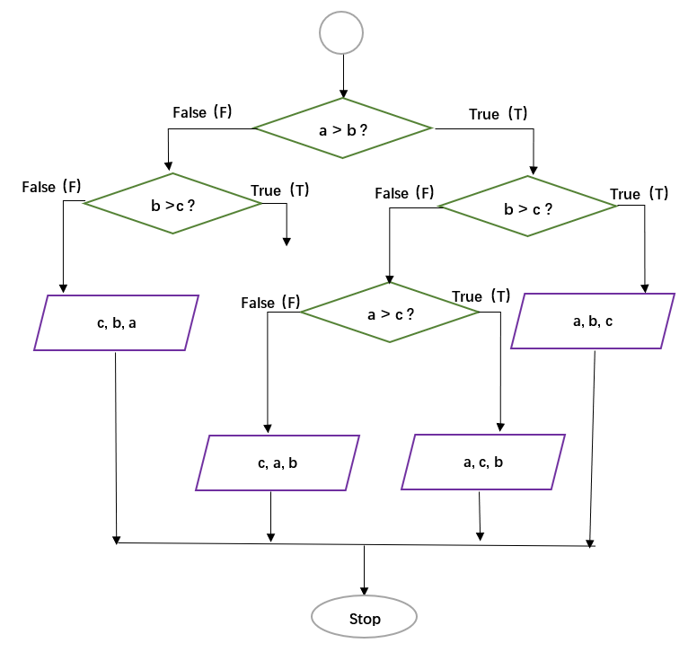

**Out: 03/04 19:00 **  
**Due: 03/18 19:00 **  

***

# Instructions  

**Collaboration:**  

Collaboration on solving the assignment is allowed, after you have thought about the problem sets on your own. It is also OK to get clarification (but not solutions) from online resources, again after you have thought about the problem sets on your own. There are two requirements: 

* Cite your collaborators **fully and completely** (*e.g.*, "XXX explained to me what is asked in problem set 3"). Or cite online resources (*e.g.*, "I got inspired by reading XXX") that helped you.

* Write your scripts and report **independently** - the scripts and report must come from you only.

**Submitting your assignment:**  

Submit your R scripts and report to TA (12332275@mail.sustech.edu.cn)

**Late Submission:**   

Late submissions will not receive any credit. 

***

# 1. Solving problems

**1.1 [10 points]** [RS], p23, Exercise #8. 

**1.2 [10 points]** [RS], p24, Exercise #17. 

**1.3 [10 points]** [RS], p24, Exercise #18.

***

# 2. Flowchart 

**[10 points]** Write a function `Print_values` with arguments `a`, `b`, and `c` to reflect the following flowchart. Here the purple parallelogram operator is to print values in the given order.  

Report your output with some random `a`, `b`, and `c` values.  

***

# 3. Matrix multiplication

**3.1 [5 points]** Generate two matrices `M1` (`5` rows and `10` columns ) and `M2` (`10` rows and `5` columns ); both are filled with random integers from `0` and `50`.

[**Hint:** use the `sample` function to draw random integers]

**3.2 [10 points]** Write a function `Matrix_multip` to do matrix multiplication. Here you are **only** allowed to use `for` loop, `*` operator, and `+` operator. 
