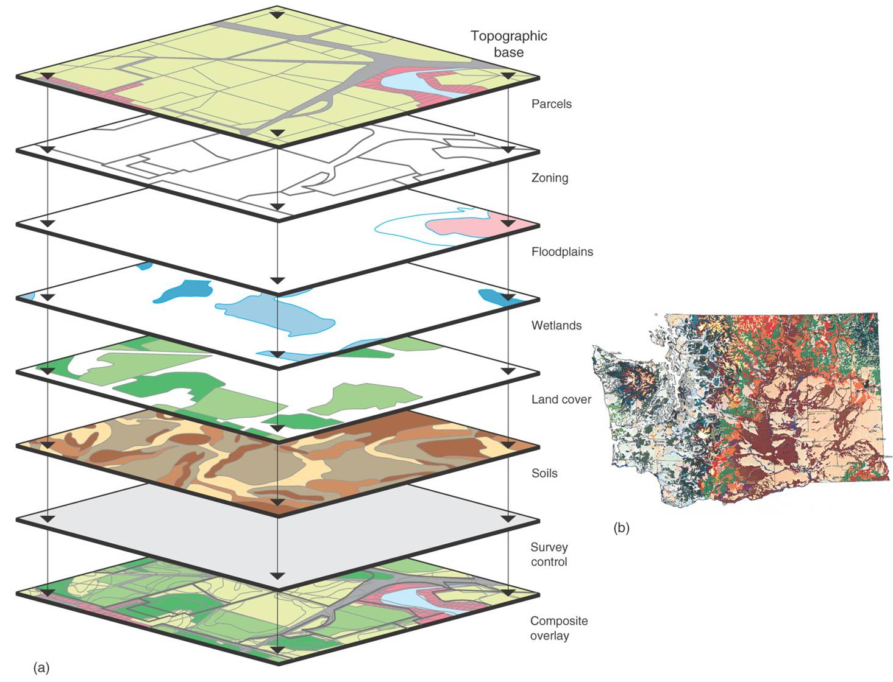

***

# Section Example: Keeling Curve
  


[Charles David Keeling](https://scrippsco2.ucsd.edu/history_legacy/charles_david_keeling_biography.html) directed a program to measure the concentrations of CO~2~ in the atmosphere that continued without interruption from the late 1950s through the present. This program, operated out of [Scripps Institution of Oceanography](https://scripps.ucsd.edu), is responsible for the Mauna Loa record, which is almost certainly the ***best-known icon*** illustrating the impact of humanity on the planet as a whole. [^1] 

We will start with [monthly CO~2~ data](https://www.esrl.noaa.gov/gmd/ccgg/trends/data.html) measured from Mauna Loa. 

[^1]: [Keeling Curve Lessons](https://scrippsco2.ucsd.edu/history_legacy/keeling_curve_lessons.html)

***

# Loading a `.csv` file

To begin with,

+ Download the `co2_mm_mlo.csv` file from [here](https://zhu-group.github.io/ese335/download/co2_mm_mlo.csv)

+ Save the file to your `working directory`. 

+ Take a look at the file, where the column `co2` means monthly average CO~2~ in the unit of `ppm` (part per million, 10^-6^), `quality` column is the quality flag of the observation, `0` means the data point does not meet the quality control so that should be discarded, `1` means the data point is usable.

Now let's *load* this file via the following:

```{r}
Keeling_Data <- read.csv(file = "co2_mm_mlo.csv", header = T)
```

The file is loaded into the dataset `Keeling_Data`. Here we use the *option* `header = T` so that the first line of `co2_mm_mlo.csv` is also loaded as names of the variables. You can try to turn this off by setting `header = F`, and check what happens.

Check the names of columns:
```{r}
colnames(Keeling_Data)
```

If column names are not specified, *e.g.*, using `headers = FALSE` in a `read.csv()` function, R assigns default names `V1`, `V2`, ..., `Vn`.

Check the head (first 6 lines) of the dataset using `head()` function
```{r}
head(Keeling_Data)
```
Or the end of (last 6 lines) with `tail()`:
```{r}
tail(Keeling_Data)
```

The `read.table()` function is used for reading in **tabular data** stored in a text file where the columns of data are separated by punctuation characters such as `.csv` files (csv = comma-separated values). Tabular files are the most common *file type* you would encounter in your future study, as it's easy to use and share.

`Tabs` and `commas` are the most common punctuation characters used to separate or delimit data points in `.csv` files. For convenience R provides 2 other versions of `read.table()`. These are: `read.csv()` for files where the data are separated with `commas` and `read.delim()` for files where the data are separated with `tabs`. Of these three functions, `read.csv()` is the most commonly used. If needed it is possible to override the default delimiting punctuation marks for both `read.csv()` and `read.delim()`.

We can begin exploring our data set right away, pulling out columns by specifying them using the `$` operator:

```{r}
Keeling_Data$co2
```

Let's do some simple statistical checks with `Keeling_Data$co2`:
```{r}
# Min
min(Keeling_Data$co2)
# Max
max(Keeling_Data$co2)
# Range
range(Keeling_Data$co2)
# Mean
mean(Keeling_Data$co2)
# Median
median(Keeling_Data$co2)
# Show quantiles
summary(Keeling_Data$co2)
```

You will find there are some `-99.99` values, which are *missing values*. We will get back to this later.

You can use `[]` to extract elements of a vector by specifying their corresponding *index*.  

<font size="2" color="red"> **Important: **</font> Index in R starts from `1`, not `0`. For example:

```{r}
Keeling_Data$co2[1:10]
Keeling_Data$year[200:210]
Keeling_Data$co2[0]
```

We can mimic the Keeling Curve using `plot()` function
```{r}
plot(Keeling_Data$decimal_date, Keeling_Data$co2)
```

It's ugly as there are a few data points with a value of `-99.99` (quality=`0`). In fact, we should never use data points with a value of `-99.99` (quality=`0`). One good way to do so is to set those values to `NA` (stands for Not Available) or *Missing Values*. 

<font size="2" color="red"> **Important: **</font> `NA` is NOT the same as `zero`.

```{r}
Year     <- Keeling_Data$decimal_date
CO2_ppm  <- Keeling_Data$co2 
CO2_ppm[which(CO2_ppm == -99.99)]  <- NA
plot(Year, CO2_ppm, type="l")
```

Here we use `which()` function to return the indexes of elements equal to `-99.99`. Use `type="l"` to plot a line, `type="p"` for points, and `type="o"` for points + line.

<font size="2" color="red"> **Important: **</font> Always use the `na.rm=T` option to handle vectors containing `NA` values.

```{r}
mean(CO2_ppm)
mean(CO2_ppm, na.rm=T)
```

***

# Missing Values

## Different kinds of missing values

Despite the best laid plans, environmental data often contain missing data. This generally is caused by the following reasons. 

+ Data points are indeed missing. For example, the instrument may be out of service, or some data records are lost.

+ Observed values are below the instrument *detection limit* (DL) or *limit of detection* (LOD). This is often seen for experimental data sets.

+ Observations are labeled as bad observations. This is usually seen in Remote Sensing data sets.

## Handeling missing values

As you can see, missing data can arise for all sorts of reasons, the problem is how to deal with it? There are lots of options for dealing with missing data, ranging from simple to complex. 

+ Perhaps the easiest solution is to ignore or delete observations with any missing data (like what just did t). This is a luxury we often cannot afford since we may have a small sample size to begin with.  

+ Another option is to replace the missing values with values based on expert prior knowledge. For example, people usually replace values below DL with `0`, DL, or half DL. This of course is risky business and should not be done unless under very special circumstances. 

+ A final solution is to estimate the missing values using methods of imputation. The simplest of these, and therefore the most commonly used, is to replace the missing value with the mean or median of the variable. The purpose behind this imputation method is to replace the missing value with a value that will no **exert any influence on the analysis**. There are much more complex methods of imputation, including for example using a statistical model to predict the missing values based on the other variables in the data set. This procedure comes at the cost of using the same data to predict the missing values as we intend to use in our final statistical model. One solution of course is to use a separate set of variables for the imputation than we intend to use in the final model. 

Regardless of the method employed, we have to be suspicious of any data set in which a large number of missing values have been replaced. [^1]

[^1]: [Analysis of Environmental DataConceptual Foundations:Data Exploration, Screening & Adjustments](http://www.umass.edu/landeco/teaching/ecodata/schedule/exploratory.pdf)


***

# Data Types in R

Let's try:
```{r}
Keeling_Data$co2[1:10] * 1e3
```
By doing so, we convert CO~2~ in a unit of ppb (part per billion, 10^-9^).  Then how about:

```{r, eval=FALSE}
Keeling_Data$month[1:10] + Keeling_Data$co2[1:10]
```
The above line won't work as `Keeling_Data$month` and `Keeling_Data$co2` has different *data types*.

In R, there are 5 main types: `double`, `integer`, `complex`, `logical`, and `character`. We can ask what type of data something is using the `typeof()` function:
```{r}
typeof(Keeling_Data$co2)
typeof(Keeling_Data$month)
typeof(Keeling_Data$quality)

x <- 1 <= 2
typeof(x)
```

By default, R uses float numbers. Use a `L` suffix to force the number to be an integer: 
```{r}
typeof(1)
typeof(1L)
```

We don't use `complex` very often; it can be defined as `a + bi`, where `a` and `b` are numbers:
```{r}
typeof(1+1i)
```

No matter how complicated our analyses become, all data in R is interpreted as one of these basic data types. 

For more about data types and structure, read this [note](https://zhu-group.github.io/ese5023/Section_03.html#Data_structure)

# Environmental data have unique features

## Temporal (time series)

As you can see from the monthly CO~2~ data, the *time series* is clearly defined. A time series is a sequence of numerical data points in successive order. Environmental data are usually sampled/stored in various time scales. Can you think about a few examples?

## Spatial 

Almost all environmental data we have today can be classified as spatial data. Spatial data tells us what is happening where. The data contains geospatial references, such as point coordinates or larger areas, but it actually includes many additional attributes. In this respect, spatial data provides the glue and the context of environmental information, essential for understanding and assessing what is happening. [^2]



[^2]: [Source](https://whmconsulting.com/wp-content/uploads/2017/01/cartografia2.jpg)

## Multivariate 

As you may imagine, it makes sense to measure more than one variable in one experiment. For example, The [Atmospheric Tomography Mission (ATom)](https://daac.ornl.gov/ATOM/campaign/documentation.html) is a flight campaign that studies the impact of human-produced air pollution on greenhouse gases and on chemically reactive gases in the atmosphere. 

So why do we want to do so? What new information we might gain using such multivariate data sets?

## Uncertain

Uncertainty refers to a lack of data or an incomplete understanding. Every measurement comes with a certiany uncertainty, which can be quantified by some efforts.

***

# In-class exercises

## Exercise #1

Using `Keeling_Data`, try the following ways to call variables or elements:

```{r, eval=F}
Keeling_Data[2]
Keeling_Data$month
Keeling_Data["month"]
Keeling_Data[2, 2]
Keeling_Data[, 2]
Keeling_Data[2, ]
```
* Can you explain what is returned by each one and why?

## Exercise #2

Use `Keeling_Data` again, compute the annual mean of CO~2~ since 1959, plot your results.

***

# Further reading

* [R Reference Card](https://cran.r-project.org/doc/contrib/Short-refcard.pdf)
* [R for Reproducible Scientific Analysis](http://swcarpentry.github.io/r-novice-gapminder/)
* [Programming with R](http://swcarpentry.github.io/r-novice-inflammation/)
* [R Introduction](http://www.r-tutor.com/r-introduction)
* [R Tutorial For Beginners - Quick-R](https://www.statmethods.net/r-tutorial/index.html)

# References  
