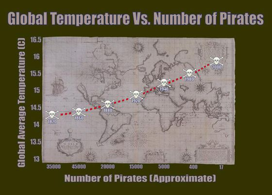

***Pre-class reading:*** [FPP] p475-482; [RS] p1-22 

***

# Section Example: Pirates vs. Global Warming

It’s official! The data’s been analyzed, and the true cause of global warming has finally been revealed: a worldwide crisis in declining pirate numbers. Don’t believe me? Well, there’s a graph to prove it [^1]:

[^1]: [Source](https://www.sisense.com/blog/global-warming-caused-lack-pirates-bad-graph-lessons/)



You can see that as the number of pirates in the world has decreased over the past 130 years, global warming has gotten steadily worse. In fact, this makes it entirely clear that if you truly want to stop global warming, the most impactful thing to do is -- become a pirate! [^2]

[^2]: [Source](https://www.forbes.com/sites/erikaandersen/2012/03/23/true-fact-the-lack-of-pirates-is-causing-global-warming/?sh=1e42063e3a67)

Hope you're laughing. Unfortunately, this kind of ridiculous and misleading causality is sold wildly every day. 

***

# Causal inference and confunding variables

Statistical analysis **alone** can be used to establish a causal relationship, only if such a relationship is drawn from **randomized experiments**, but not from **observational studies**. The difference between randomized and observational studies is that whether the group status of the subjects can or can not be controlled by the investigator.

In an observational study, it is impossible to draw a causal conclusion from the statistical analysis alone, because one can not rule out the possibility that **confounding variables** are responsible for group differences in the measured outcome. So can you give some confounding variables in the Pirates vs. Global Warming example?

Observational studies are still very useful in research because:

+ Establishing causation is not always the goal

+ Establishing causation can be done in other ways

+ Observations may suggest an association

*** 

# Hypothesis tests

Briefly, hypothesis tests use data from a sample to infer the value of a population parameter. 

The first step in conducting a hypothesis test is to write the hypothesis statements that are going to be tested. For each test, you will have a **null hypothesis** (H~0~) and an **alternative hypothesis** (H~a~ or H~1~). In general, the null hypothesis is the one that specifies a simpler state of affairs, typically an absence of an effect.

The next step is to compute the **p-value**, which is defined as:

Given that the null hypothesis is true, a p-value is the probability that randomization alone leads to a test statistic **as extreme or more extreme** than the one observed.

Finally, we use the p-value to evaluate **statistical significance**. If we fail to reject the null hypothesis and there is no evidence to support the alternative hypothesis. These results are said to be not **statistically significant**. If then we reject the null hypothesis and conclude that there is evidence to support the alternative hypothesis. These results are statistically significant.

The general procedures are:

+ Write the hypotheses

+ Construct a randomization distribution under the assumption that the null hypothesis is true

+ Use the randomization distribution to find the p-value

+ Decide if you should reject or fail to reject the null hypothesis

+ State a real-world conclusion in relation to the original research question

***

## A randomization test example

Suppose we want to test whether a new technology is useful in removing pollutant X. To do so, we prepare `6` cases, randomly select `3` cases and apply the technology, leaving the rest without treatment. Then we measure X levels from the two groups (no unit).

+ Group A (new technology applied): `1.0`, `2.0`, `3.0`

+ Group B (no treatment): `2.0`, `3.0`, `4.0`

So the mean of group A is `2.0`, mean of group B is `3.0`, with a difference ($d$) of `-1.0`. One may argue the difference is caused by the new technology; while it is also possible that the difference could be driven by randomization when no treatment being applied. So the question is: can the observations back up the usefulness of the new technology?

In this set up, the hypotheses are:

+ H~0~: The new technology has no effects in removing X

+ H~1~: The new technology does have effects in removing X

Let's assume H~0~, what is the chance of randomization leads to the observed or more extreme difference? In other words, what is the chance of grouping leads to the observed or more extreme difference given H~0~ is true? This can be written as:

$$P(d <= -1.0 | H_{0} )$$
Since the sample size is small, we can write all possible groupings (combinations) for A with R.

```{r}
# Need `gtools` package
library(gtools)

# Obs from group A
Obs_A   <- c(1.0,2.0,3.0)

# Obs from group B
Obs_B   <- c(2.0,3.0,4.0)

# Compute the difference, d
diff <- mean(Obs_A) - mean(Obs_B)
print(diff)

# Given H0 is true, we assume that A and B are from the same population
# So the total possible groupings for A is C(6,3) 
Obs_all     <- c(Obs_A, Obs_B)
Groupings_A <- combinations(length(Obs_all),length(Obs_A),Obs_all,F)

# Show all possible groupings of A
print(Groupings_A)
```

Next, we can compute all possible differences:

```{r}
# Make an empty list
d <- c()

# Loop all possible grouping methods for A
for(i in 1:dim(Groupings_A)[1]){
  # Mean of group A
  mean_A <- mean(Groupings_A[i,])
  
  # Mean of group B
  mean_B <- (sum(Obs_all)-sum(Groupings_A[i,]))/length(Obs_B)
  
  # Difference
  d <- c(d, mean_A - mean_B)
}

# Show all possible differences
print(d)

# Plot all possible differences
hist(d)

# Add a vertical line
abline(v=diff, col="red", lwd=5, lty=2)
```

OK, given H~0~ is true, what is the chance that grouping leads to the observed or more extreme difference? From the above plot, we count that there are `5` cases out of `20` cases that the difference is as extreme or more extreme than `-1.0`. 

```{r}
# Compute p-value
length(which(d<=diff))/length(d)
```

The p-value, in this case, is `0.25`, which is not a small value (compared with `0.05`). So we can not rule out that H~0~, meaning the observations fail to back up the usefulness of the new technology.

Now change the observations to:

+ Group A (new technology applied): `1.0`, `2.0`, `3.0`

+ Group B (no treatment): `20.0`, `30.0`, `40.0`

Re-compute the p-value, see what would change. Can you explain why?

***

## Exercise #1

Suppose we want to test another new technology, to check whether it is useful in increasing student's scores. To do so, we recruit `9` students, randomly select `5` of them to apply this technology, leaving the rest students without treatment. Then we measure scores from the two groups:

+ Group A (new technology applied): `2.0`, `3.0`, `4.0`, `5.0`, `6.0`

+ Group B (no treatment): `1.0`, `2.0`, `3.0`, `4.0`

Do the observations back up the usefulness of such new technology? Please use a significant level of `0.10`.

## Exercise #2

Suppose we want to test another new technology, to check whether it has impact on (could increase or reduce) student's scores. To do so, we recruit `9` students, randomly select `5` of them to apply this technology, leaving the rest students without treatment. Then we measure scores from the two groups:

+ Group A (new technology applied): `2.0`, `3.0`, `4.0`, `5.0`, `6.0`

+ Group B (no treatment): `1.0`, `2.0`, `3.0`, `4.0`

What is the p-value now? Why is it different from the p-value from the previous exercise #1?
