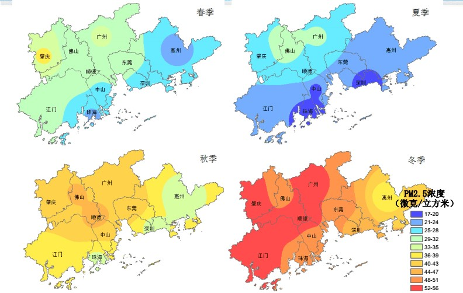

***

# Prerequisites

Load the libraries with R:
```{r}
library(ggpubr)
library(nortest)
library(ggplot2)
```

***

# Section Example: PM2.5 in Shenzhen and Guangzhou 



[Figure Source](https://image.baidu.com/search/detail?ct=503316480&z=&tn=baiduimagedetail&ipn=d&word=%E7%8F%A0%E4%B8%89%E8%A7%92%20%E7%A9%BA%E6%B0%94%E6%B1%A1%E6%9F%93&step_word=&ie=utf-8&in=&cl=2&lm=-1&st=-1&hd=&latest=&copyright=&cs=3586034044,4215113255&os=1099056367,4194659787&simid=3586034044,4215113255&pn=73&rn=1&di=7060663421280190465&ln=1585&fr=&fmq=1647172268205_R&fm=result&ic=&s=undefined&se=&sme=&tab=0&width=&height=&face=undefined&is=0,0&istype=2&ist=&jit=&bdtype=0&spn=0&pi=0&gsm=1e&objurl=https%3A%2F%2Fgimg2.baidu.com%2Fimage_search%2Fsrc%3Dhttp%253A%252F%252Fview-cache.book118.com%252Fview18%252FM02%252F13%252F20%252FwKh2D2CsspGAXqMfAAEoSo4_p_w393.png%26refer%3Dhttp%253A%252F%252Fview-cache.book118.com%26app%3D2002%26size%3Df9999%2C10000%26q%3Da80%26n%3D0%26g%3D0n%26fmt%3Dauto%3Fsec%3D1649764271%26t%3Ddad67976f2a3b5f28378714ccfc85f58&rpstart=0&rpnum=0&adpicid=0&nojc=undefined&dyTabStr=MCw2LDUsMSw0LDMsMiw3LDgsOQ%3D%3D&ctd=1647172353474^3_1519X667%1)

Suppose we want to compare PM2.5 levels in Shenzhen and Guangzhou. To do so, PM2.5 concentrations are measured by two groups with the same instrument. 

In 2020, `10` observations are made in Shenzhen:

`25.6, 23.7, 21.9, 26.0, 24.5, 22.4, 26.7, 24.6, 22.7, 23.8`

and `12` observations are made in Guangzhou:

`27.1, 24.2, 27.9, 33.3, 26.4, 28.7, 25.6, 23.2, 24.0, 27.1, 26.2, 24.4`

We know from previous data that PM2.5 levels in the two cities generally follow normal distributions. And the standard deviation for Shenzhen and Guangzhou is `2.0` ug/m^3^ and `3.0` ug/m^3^, respectively.

It seems Shenzhen has a lower PM2.5 level than Guangzhou. Can such a difference be explained on the basis of chance variation? Can you explain why the spread of the data also contributes to the difference?

***

# The Z-test

Recall the definition of Z-Ratio:

$$Z=\frac {Estimate - Parameter} {SD(Estimate)}  $$

Since the task is to compare PM2.5 in the two cities, in the statistical framework, it would be: 

+ H0: Mean PM2.5 level in Shenzhen is the same as that in Guangzhou ($\mu_1 = \mu_2$)

+ H1: Mean PM2.5 level in Shenzhen is not the same as that in Guangzhou ($\mu_1 \ne \mu_2$)

To test the hypothesis (H0), we will use *Z-Ratio* again, which is defined as:

$$Z=\frac {Estimate - Parameter} {SD(Estimate)}  $$
In this case, $Estimate$ is the difference between sample averages ($\overline{X_1} -\overline{X_2} $), and $Parameter$ is the difference between population mean ($\mu_1 - \mu_2$). 

$$Z=\frac { (\overline{X_1} - \overline{X_2} ) - (\mu_1 - \mu_2) } {SD(\overline{X_1} - \overline{X_2}) }   $$
If the two samples are from two **normal** distributions, $SD(\overline{X1} - \overline{X_2})$ can be determined as:

$$ SD(\overline{X_1} - \overline{X_2}) = \sqrt { \frac{\sigma_1^2} {n_1} +  \frac{\sigma_2^2} {n_2} }   $$
where $\sigma_1$ and $\sigma_2$ is the standard deviation of the two populations, and $n_1$ and $n_2$ is the size of the two samples. Now we have:

$$Z=\frac { (\overline{X_1} - \overline{X_2} ) - (\mu_1 - \mu_2) } {\sqrt { \frac{\sigma_1^2} {n_1} +  \frac{\sigma_2^2} {n_2} } }   $$
and $Z \sim N(0,1)$.

Assuming H0 is true, we get $Z$ is `-2.16`. Then with R, we can compute the two-side p-value for this statistic.

Before computing $Z$, let's check the data first.

```{r}
# Shenzhen 
SZ_PM2.5  <- c(25.6, 23.7, 21.9, 26.0, 24.5, 22.4, 26.7, 24.6, 22.7, 23.8)
SZ_n      <- length(SZ_PM2.5)
SZ_sigma  <- 2.0

# Guangzhou
GZ_PM2.5  <- c(27.1, 24.2, 27.9, 33.3, 26.4, 28.7, 25.6, 23.2, 24.0, 27.1, 26.2, 24.4)
GZ_n      <- length(GZ_PM2.5)
GZ_sigma  <- 3.0

# Make data frame
PM2.5_data <- data.frame(PM2.5 = c(SZ_PM2.5, GZ_PM2.5),
                         City = c(rep("Shenzhen",SZ_n),rep("Guangzhou",GZ_n)))

# Compare boxplots
PM2.5_data %>% 
  ggplot(aes(x=as.character(City), y=PM2.5)) +
  geom_boxplot(fill="steelblue") +
  labs(title="PM2.5 Distribution by City", x="City", y="ug/m3")

# Check normality qqplot
PM2.5_data %>% 
 ggplot(aes(sample = PM2.5)) + 
  geom_qq_line() + geom_qq() +
  facet_wrap(~ City)

# Check normality Shapiro-Wilk test
shapiro.test(SZ_PM2.5)
shapiro.test(GZ_PM2.5)

# Sample difference
mean(SZ_PM2.5) - mean(GZ_PM2.5)

# Get Z-ratio
Z        <- (mean(SZ_PM2.5) - mean(GZ_PM2.5)) / 
            sqrt( SZ_sigma^2/SZ_n + GZ_sigma^2/GZ_n )

# Find the two-side p-value
# The pnorm function gives the Cumulative Distribution Function (CDF) 
# of the Normal distribution in R, which is the probability that 
# the variable takes a value lower or equal to a threshold (here |Z|).
P_value   <- (1-pnorm(abs(Z), mean=0, sd=1))*2

print(P_value)
```

OK, we have a probability of about `3.06%` getting a statistic ($Z$) as extreme or more extreme than the observed statistic (`-2.16`), assuming H0 is true. This is a small probability, and is likely due to chance. We can reject H0 given the observations. Thus, the mean PM2.5 level in Shenzhen is not the same as that in Guangzhou.

***

# Independent two-sample t-test

As we saw from the last Section, SDs of populations ($\sigma_1$ and $\sigma_2$) are generally unknown. And we need to use sample SE as an estimate of the population SD, and the the proceeding Z test becomes the t test:

$$ t =\frac { (\overline{X_1} - \overline{X_2} ) - (\mu_1 - \mu_2) } {SE(\overline{X_1} - \overline{X_2}) } $$
For a independent two-sample t-test (Note: we use the "equal SD" method in here, see page 40 in [R.S.] for more):

$$ SE(\overline{X_1} - \overline{X_2}) = s_p \sqrt { \frac{1} {n_1} +  \frac{1} {n_2} }   $$
$s_p$ is *pooled SD*, or pooled estimate of standard deviation.

$$ s_p = \sqrt { \frac{(n_1-1)s_1^2 + (n_2-1)s_2^2} {n_1 + n_2 -2} }$$
where $s_1$ and $s_2$ is the standard deviation of the two samples. And the number of degrees of freedom associated with $s_p$ is the sum of degrees of freedom from the individual estimates. 

Finally, we have the $t$ statistic from an independent two-sample t-test being:

$$t=\frac { (\overline{X_1} - \overline{X_2} ) - (\mu_1 - \mu_2) } { \sqrt { \frac{(n_1-1)s_1^2 + (n_2-1)s_2^2} {n_1 + n_2 -2} (\frac{n_1+n_2} {n_1n_2}) }} $$
And $t$ statistic follows a Student's t distribution on $n_1 + n_2 - 2$ degrees of freedom. 

Let's use the observations again, but now we have no information about the population SDs. Therefore, we need to conduct an independent two-sample t-test. 

+ H0: Mean PM2.5 level in Shenzhen is the same as that in Guangzhou ($\mu_1 = \mu_2$)

+ H1: Mean PM2.5 level in Shenzhen is not the same as that in Guangzhou ($\mu_1 \ne \mu_2$)

In this case, $\overline X_1 - \overline X_2$ is again `-2.32`, $SE(\overline{X_1} - \overline{X_2})$ is `0.98`, assuming H0 is true ($\mu_1 - \mu_2 = 0$), we have $t$=`-2.37`.

Then the p-value can be calculated manually:

```{r}

# Shenzhen 
SZ_PM2.5  <- c(25.6, 23.7, 21.9, 26.0, 24.5, 22.4, 26.7, 24.6, 22.7, 23.8)

# Guangzhou
GZ_PM2.5  <- c(27.1, 24.2, 27.9, 33.3, 26.4, 28.7, 25.6, 23.2, 24.0, 27.1, 26.2, 24.4)

# Sample difference
mean(SZ_PM2.5) - mean(GZ_PM2.5)

# Get sample size, degrees of freedom, and sd
n1        <- length(SZ_PM2.5)
df1       <- n1 - 1
sd1       <- sd(SZ_PM2.5)

n2        <- length(GZ_PM2.5)
df2       <- n2 - 1
sd2       <- sd(GZ_PM2.5)

# SE of the difference
SE        <- sqrt( (df1*sd1^2 + df2*sd2^2)/(df1+df2) * (n1+n2)/(n1*n2) )

# Get t-ratio
t         <- (mean(SZ_PM2.5) - mean(GZ_PM2.5))/SE

# Find the two-side p-value
# The pt function gives the Cumulative Distribution Function (CDF) 
# of the Student's t distribution in R, which is the probability that 
# the variable takes a value lower or equal to a threshold (here |t|).
P_value  <- (1-pt(abs(t), df=df1+df2))*2

print(P_value)
```

Now, we have a probability of about `2.80%` getting a statistic ($t$) as extreme or more extreme than the observed statistic (`-2.37`), assuming H0 is true. This is a small probability, and is likely due to chance. We can reject H0 given the observations. Thus, the mean PM2.5 level in Shenzhen is not the same as that in Guangzhou.

***

# Independent two-sample t-test with R

In R, you can simply conduct the previous independent two-sample t-test as:

+ H0: Mean PM2.5 level in Shenzhen is the same as that in Guangzhou ($\mu_1 = \mu_2$)

+ H1: Mean PM2.5 level in Shenzhen is not the same as that in Guangzhou ($\mu_1 \ne \mu_2$)

In R, this is done by:

```{r}

# Shenzhen 
SZ_PM2.5  <- c(25.6, 23.7, 21.9, 26.0, 24.5, 22.4, 26.7, 24.6, 22.7, 23.8)

# Guangzhou
GZ_PM2.5  <- c(27.1, 24.2, 27.9, 33.3, 26.4, 28.7, 25.6, 23.2, 24.0, 27.1, 26.2, 24.4)

# Call t.test function
# Since H1 states a different PM2.5 value in Shenzhen, 
# we need to compute the two-sided p-value
t.test(SZ_PM2.5, GZ_PM2.5, alternative="two.sided", var.equal=T)
```
As you may notice, here we set `var.equal = T` when call the `t.test()` function. By doing so, we assume an "equal SD" method, please see page `40` in [R.S] for more. By default, R uses the "unequal SD" method, which returns a slightly different t statistic and d.f. We will look at this in the future.

***

# In-class exercises

## Exercise #1

Two labs (Lab 1 and 2) use the same method to measure the TSP concentration of one air sample. The readings are as follow:

+ Lab 1: `14.7, 14.8, 15.2, 15.6`

+ Lab2: `14.6, 15.0, 15.2`

Based on the data, are results from the two labs consistent?

+ 1.1 What is the H0 and H1?

+ 1.2 Do you use one-side or two-side p-value?

+ 1.3 Are results from the two labs consistent?

## Exercise #2

A local environmental officer wants to compare two rivers to see if there are any difference in COD. From river A, the officer randomly collected `15` water bottles, and COD is measured as follows:

`915.4, 789.3, 828.2, 811.4, 832.4, 841.7, 871.6, 830.8, 884.5, 847.5, 841.4, 936.7, 977.0, 825.2, 707.9`

From river B, the officer randomly collected `10` water bottles with COD read as:

`804.0, 779.8, 749.3, 877.4, 753.8, 778.6, 807.5, 913.3, 784.8, 659.7`

+ 2.1 Plot two boxplots side by side

+ 2.2 Check the normality of the two samples

+ 2.3 Do you use a Z-test or a t-test?

+ 2.4 What is the H0 and H1?

+ 2.5 Do you use one-side or two-side p-value?

+ 2.6 Report your findings