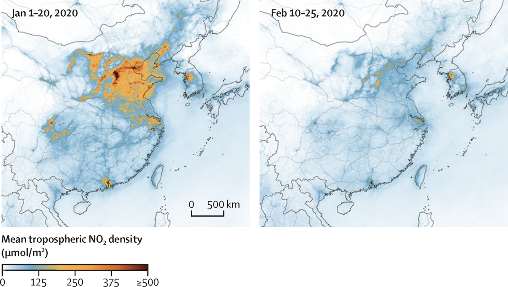

***

# Prerequisites

Load the libraries with R:

```{r}
library(ggpubr)
library(nortest)
library(ggplot2)
```

***

# Section Example: COVID-19 lockdown and air quality 



[Figure Source](https://www.thelancet.com/journals/lanplh/article/PIIS2542-5196(20)30201-1/fulltext)

The COVID-19 pandemic outbreak has reshaped normal social and economic activities dramatically, resulting in sudden changes in the emissions of air pollutants and their precursors. To investigate the impact of lockdown on air quality, we compare monthly PM2.5 (ug m^-3^) in February of 2019 and 2020 in the following `15` cities.

City   |2019 |2020 |2020-2019|
|:----:|:---:|:---:|:-------:|
|Beijing  |53   |63   | -10     |
|Shanghai  |41   |33   | -8      |
|Guangzhou  |26   |24   | -2      |
|Shenzhen  |19   |19   | 0       |
|Kunming  |26   |33   | +7      |
|Chongqing  |48   |49   | +1      |
|Wuhan  |64   |38   | -26     |
|Hangzhou  |46   |28   | -18     |
|Lanzhou  |42   |41   | -1      |
|Hefei  |65   |36   | -29     |
|Changsha  |53   |41   | -12     |
|Changchun  |81   |43   | -38     |
|Dalian  |51   |43   | -8      |
|Fuzhou  |32   |23   | -9      |
|Nanning  |44   |35   | -9      |
|Mean |46.1 |36.6 | -9.5    |

[Data source](http://www.mee.gov.cn/hjzl/dqhj/cskqzlzkyb/index_1.shtml)

It seems the mean PM2.5 level is lower in 2020. Can such a difference be explained on the basis of chance variation? 

Can we use the [independent two-sample t-test](https://zhu-group.github.io/ese335/S07.html#Independent_two-sample_t-test_with_R) from the last Section to test the significance of such difference? Why or why not?

***

# The paired sample t-test

A *paired sample t-test*, also called the **dependent** sample t-test, is used to compare two population means in the case of two samples that are **correlated**. Two measurements are paired when they come from the same observational unit. The pairing has nothing to do with the actual data values but, rather, with the way the data values are obtained. Examples of where this might occur are:

+ Before-and-after observations on the same subjects (e.g. pollutant levels before and after a particular treatment).

+ A comparison of two different methods of measurement or two different treatments where the measurements/treatments are applied to the same subjects (e.g. pollutant measurements using a remote sensing method and a *in situ* technology).

The paired-sample t-test is the same as the [one-sample t-test](https://zhu-group.github.io/ese335/S06.html#One_sample_t-test) as the difference ($D$) between the two populations ($X_1$ and $X_2$) is tested against zero.

Recall the definition of t-Ratio:

$$t=\frac {Estimate - Parameter} {SE(Estimate)}  $$
Here the standard error (SE) refers to the sample. If $s$ is the sample SD of the difference, the SE for the estimate ($\overline {D}$) is: 

$$SE(\overline {D})=\frac {s} {\sqrt{n}}$$
For a paired sample t-test:

$$ t =\frac { \overline{D}  - \mu_D } { {s} / \sqrt{n} } $$
And $t$ statistic follows a Student's t distribution on $n - 1$ degrees of freedom. 

For our research question, 

+ H0: Mean PM2.5 in the Feb. of 2020 is the same as that in 2019 in the given cities ($\mu_D = 0$)

+ H1: Mean PM2.5 in the Feb. of 2020 is not the same as that in 2019 in the given cities ($\mu_D \ne 0$)

In this case, $\overline D$ is `-9.47`, $SE(\overline{D})$ is `3.47`, assuming H0 is true ($\mu_D = 0$), we have $t$=`-2.73`.

Then the p-value can be calculated manually:

```{r}

# PM2.5 in 2019 Feb.
PM2.5_2019  <- c(53, 41, 26, 19, 26, 48, 64, 46, 42, 65, 53, 81, 51, 32, 44)

# PM2.5 in 2020 Feb.
PM2.5_2020  <- c(63, 33, 24, 19, 33, 49, 38, 28, 41, 36, 41, 43, 43, 23, 35)

# Make data frame
PM2.5_data <- data.frame(PM2.5 = c(PM2.5_2019, PM2.5_2020),
                         Year = c(rep("2019-02",n),rep("2020-02",n)))

# Compare boxplots
PM2.5_data %>% 
  ggplot(aes(x=as.character(Year), y=PM2.5)) +
  geom_boxplot(fill="steelblue") +
  labs(title="PM2.5 Distribution by Year", x="Year", y="ug/m3")

# Sample difference
Diff        <- PM2.5_2020 - PM2.5_2019

# Get sample size, degrees of freedom, and sd
n           <- length(Diff)
df          <- n - 1
sd          <- sd(Diff)

# Check normality, qqplot
ggqqplot(Diff)

# Check normality, Shapiro-Wilk test
shapiro.test(Diff)

# SE of the difference
SE          <- sd/sqrt(n)

# Get t-ratio
t           <- mean(Diff)/SE

# Find the two-sided p-value
# The pt function gives the Cumulative Distribution Function (CDF) 
# of the Student's t distribution in R, which is the probability that 
# the variable takes a value lower or equal to a threshold (here |t|).
P_value     <- (1-pt(abs(t), df=df))*2

print(P_value)
```

Now, we have a probability of about `1.6%` getting a statistic ($t$) as extreme or more extreme than the observed statistic (`-2.73`), assuming H0 is true. This is a small probability, and is not likely due to chance. We, therefore, reject H0 given the observations. Thus, mean PM2.5 in the Feb. of 2020 is **statistically significant** different from that in 2019 in the given cities. The observations **suggest** that the massive lockdown in China during 2020 Feb. may lead to a lower PM2.5 level, compared with the same period in 2019.

***

# Paired sample t-test with R

In R, you can simply conduct the previous paired sample t-test as:

+ H0: Mean PM2.5 in the Feb. of 2020 is the same as that in 2019 in the given cities ($\mu_D = 0$)

+ H1: Mean PM2.5 in the Feb. of 2020 is not the same as that in 2019 in the given cities ($\mu_D \ne 0$)

In R, this is done by:

```{r}

# PM2.5 in 2019 Feb.
PM2.5_2019  <- c(53, 41, 26, 19, 26, 48, 64, 46, 42, 65, 53, 81, 51, 32, 44)

# PM2.5 in 2020 Feb.
PM2.5_2020  <- c(63, 33, 24, 19, 33, 49, 38, 28, 41, 36, 41, 43, 43, 23, 35)

# Call t.test function
# Here we compare the sample average with a known mean (0)
# Since H1 states a different PM2.5 level in 2020,
# we use two-sided p-value
# Pay attention the order of two samples
t.test(PM2.5_2020, PM2.5_2019, alternative="two.sided", paired=T)
```

Here we set `paired=T` when call the `t.test()` function. By doing so, R knows we would like to do a paired sample t-test. 

***

# Confidence interval for the difference

As you may notice, another thing comes out from the proceeding t-test is a range (`-16.9` to `-2.0`), called *95 percent confidence interval*. A confidence interval (CI) refers to **the probability that a population parameter will fall between a set of values for a certain proportion of times**. 

Confidence intervals measure the degree of uncertainty or certainty in a sampling method. They can take any number of probability limits, with the most common being a `95%` or `99%` **confidence level**. From the proceeding t-test, the `95%` CI can be stated as: `95%` of times $\mu_D$ will fall within the range between `-16.9` and `-2.0`. 

Let's use the definition of $t$ ratio to understand the confidence intervals. 

$$ t =\frac { \overline{D}  - \mu_D } { {s} / \sqrt{n} } \sim t_{df=n-1} $$
For a given t distribution on the degrees of freedom of n-1, `95%` of values in this distribution will fall between two endpoints that make the corresponding probability of `95%`. In this case (d.f.=`14`), it's `-2.14` and `2.14`:

```{r}
# Make a vector from -5 to 5, with a step of 0.01 
x        <- seq(-5.0, 5.0, by=0.01)

# Compute the density for each element in x
# Set the degrees of freedom to be 14
density <- dt(x, df=14)

# Plot Density
plot(x, density, col="black", xlab="", ylab="Density", 
     type="l", lwd=3, cex=2, 
     xlim=c(-5.0, 5.0),
     main="PDF of t (d.f. = 14) distribution")

# Get the 2.5th percentile
p_2.5th  <- qt(0.025,df=14)

# Get the 97.5th percentile
p_97.5th <- qt(0.975,df=14)

# Add vertical lines
abline(v=p_2.5th,  col="red", lwd=2, lty=2)
text(p_2.5th-1, 0.1, as.character(round(p_2.5th,2)), col="red", cex=1.5)
abline(v=p_97.5th, col="red", lwd=2, lty=2)
text(p_97.5th+1, 0.1, as.character(round(p_97.5th,2)), col="red", cex=1.5)

```

That is, if we randomly draw `10000` samples ($X_1 -X_2$), `9500` of those samples would have a $t$ ratio that falls between `-2.14` and `2.14` in theory, and `500` of those samples would fall outside the interval. For the `9500` samples that with $t$ ratio between `-2.14` and `2.14`, so we have:

$$ -2.14 \le \frac { \overline{D}  - \mu_D } { {s} / \sqrt{n} } \le 2.14  $$
which is equivalent to say that, `9500` of the `10000` times the unknown population mean ($\mu_D$) would be within the following interval:

$$ \overline{D} - 2.14 * \frac {s} {\sqrt{n}} \le \mu_D \le \overline{D} + 2.14 * \frac {s} {\sqrt{n}}  $$
and we have:

$$ -16.9 \le \mu_D \le -2.0  $$
This is exactly the same as the R output. Now, we understand that this range represents that `95%` of the time the unknown population mean ($\mu_D$) would fall within the range between `-16.9` and `-2.0`. As such, mean PM2.5 level in 2020 Feb. is lower than that in 2019 by `16.9` to `2.0` ug m^-3^ (95% CI). Or another way to put it, PM2.5 level in 2020 Feb. on average is lower than that in 2019 by `16.9` to `2.0` ug m^-3^ (95% CI).

A general way to write the CI (`100(1-x)%` confidence level) of unknown population mean ($\mu_D$) would be:

$$ \overline{D} - t_{df=n-1}(1-0.5x) \frac {s} {\sqrt{n}} \le \mu_D \le \overline{D} + t_{df=n-1}(1-0.5x) \frac {s} {\sqrt{n}}  $$
where $t_{df=n-1}(1-0.5x)$ is the `100(1-0.5x)`th percentile of the t distribution on $n-1$ degrees of freedom.

In fact, we have seen CI as default R output from the [one-sample t-test](https://zhu-group.github.io/ese335/S06.html#One_sample_t-test) and [independent two-sample t-test](https://zhu-group.github.io/ese335/S07.html#Independent_two-sample_t-test_with_R). You should be able to explain the meaning of each CI. Please try. 


***

# In-class exercises

## Exercise #1

To reduce traffic noise, city X brings in a new regulation of not using horns within a certain area. A research group measures noise levels (L~90~) from `8` representative locations within this area, before and after the regulation (unit: dB).

+ Before the regulation: `51, 48, 52, 62, 64, 51, 55, 60`

+ After the regulation: `46, 45, 53, 48, 57, 55, 42, 50`

Based on the observations, is the regulation effective in reducing the noise of this area?

1.1 Which test will you use?

1.2 What is the H0 and H1?

1.3 Do you use one-sided or two-sided p-value?

1.4 Is the regulation effective in reducing the noise of this area? Here use a **significant level** of `0.05`.

1.5 If the regulation is effective in reducing the noise of this area, then by how much? Report your results using a **confidence level** of `95%`.

## Exercise #2

Suppose we want to test the reliability of a remote sensing method in measuring CO~2~. For a given location, the in situ measurements (ppm) for `10` days read as:

+ In situ: `415, 385, 378, 398, 413, 359, 391, 410, 390, 402`

Meanwhile, the corresponding remote sensing results are:

+ Remote sensing: `412, 361, 401, 432, 413, 385, 378, 412, 420, 400`

2.1 Is this remote sensing method reliable in measuring CO~2~? 

2.2 Report the CI for the difference. Does the 95% CI contain `0`? What does that mean in term of determining a significant difference between the two population means?

## Exercise #3

Recall the [Exercise #2](https://zhu-group.github.io/ese335/S07.html#Exercise_2) from Section 07, compute the `90%`, `95%`, and `99%` CI for the difference between mean COD from the two rivers. Can you explain why CI is wider for a higher confidence level?