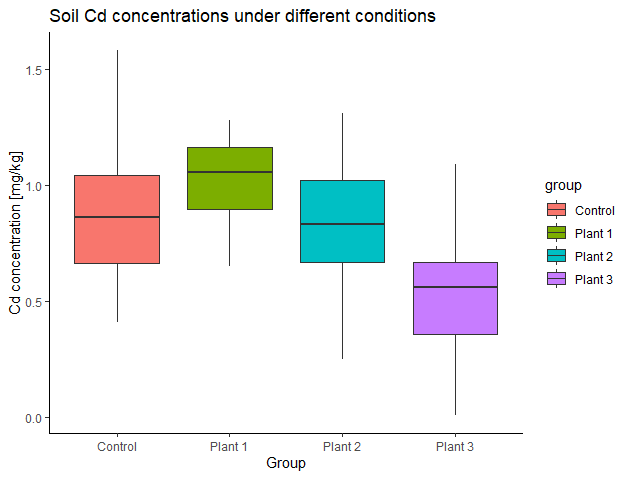

***

# Prerequisites

Load the libraries with R:
```{r}
library(ggplot2)

```

***

# Section Example: Removal of cadmium from soil by plants

Cadmium (Cd) has been identified as the priority control metal in China due to its higher concentrations in soil and higher health risks posed to the public. (Chen et al., Contamination features and health risk of soil heavy metals in China, *Science of The Total Environment*, 512–513, p.143-153, 2015).

Plants are able to remove soil Cd via the uptaking of the root. To test the impact of different plants on Cd removal, a researcher measured Cd concentrations (mg/kg) under `4` conditions. For each condition/group, soil Cd was independently measured several times.

+ Control: `0.64, 0.91, 0.84, 0.41, 1.58, 0.48, 0.88, 0.74, 1.09, 1.28`

+ With plant #1: `1.20, 1.17, 0.76, 0.92, 0.65, 1.14, 1.05, 1.28, 0.89, 1.06`

+ With plant #2: `0.25, 1.31, 0.43, 1.18, 1.02, 0.83, 1.02, 0.66, 0.70, 0.83`

+ With plant #3: `0.63, 0.30, 0.49, 0.01, 0.63, 0.69, 0.68, 0.34, 1.09, 0.42`

Here are the side-by-side boxplots:



Do soil Cd concentrations differ under the four conditions? Or do different plants influence soil Cd concentration differently? How to test this? Can we use the t-tools from previous sections?

***

# One-way ANOVA basics

*Analysis of variance* (ANOVA) is one of the most frequently used techniques in the environmental sciences. ANOVA is used to contrast a continuous dependent variable (e.g., soil Cd concentrations) across *levels* of one or more categorical independent variables (also called *factors*). In the section example, there is only one categorical independent variable that has `4` levels (control, plant #1, plant #2, and plant #3). For ANOVA dealing with only one factor, it is called one-way ANOVA or one-factor ANOVA. 

One-way ANOVA is similar to the two samples t-test. The later one is used for comparison of population means across **two levels**, while one-way ANOVA is used for the comparison of population means across **more than two levels** (note that, the levels are determined by only one factor). The logic of ANOVA is essentially the same as the t-test - it compares variability between groups to variability within groups to determine whether the observed differences are due to chance or not.

## Variation between and within groups

Suppose there are $M$ levels of observations in the sample $X$, so we have $X=\{ X_1, X_2, \dots, X_M \}$. For each level $m$ ($m=1,2,\dots,M$), the sample size of corresponding sub-sample $X_m$ is $n_m$. Let's use $N$ to denote the overall sample size of $X$, so  $N=n_1+n_2+\dots+n_M$. 

The **total variability** of the variable can be measured by the sum of squares total (SS~T~), given by:

$$SS_T = \sum_{i=1}^{N}(x_i-\overline X)^2$$
where $x_i$ corresponds to the *i*^th^ observation of $X$ and $\overline X$ to the overall mean of $X$.

The sum of squares between groups (SS~B~) is a measure for the **variability between groups**. SS~B~ corresponds to the SD of group means ($\overline X_m$) from the overall mean ($\overline X$), weighted by the sample size ($n_m$).

$$SS_B = \sum_{m=1}^{M}[n_m(\overline {X_m}-\overline X)^2]$$

Finally, the sum of squares within groups (SS~W~) is a measure for the **variability within groups**. SS~W~ is associated with the variability that cannot be explained by the group variable. 

$$SS_W = \sum_{m=1}^{M} \sum_{k=1}^{n_m}(x_k-\overline {X_m})^2$$
where $x_k$ corresponds to the *k*^th^ observation of the sub-sample $X_m$, and $k=1,2,\dots,n_m$.

One can easily prove that:

$$SS_T = SS_B + SS_W$$

## Measures of mean variability

To get an average variability, we scale the above measures of variability by the degrees of freedom. The degrees of freedom are defined for each partition of variability (SS~T~, SS~B~, and SS~W~).

For the total variability (SS~T~):

$df_T=N-1$

For the variability between groups (SS~B~): 

$df_B=M-1$

For the variability within groups (SS~W~):

$df_W=N-M$

The mean variability between groups (MS~B~) is:

$MS_B=\frac {SS_B} {df_B}$

And the mean variability within groups (MS~W~) is:

$MS_W=\frac {SS_W} {df_W}$

## *F* statistic

Finally, we compare the mean variation between the groups, MS~B~, to the variation within the groups, MS~W~, by calculating the ratio between the two (denoted as *F*). 

$F=\frac {MS_B} {MS_W}$

The *F*-statistic follows the **F-distribution** (named after Ronald A. Fisher) with a two degrees of freedom $df(M-1,N-M)$:

$F=\frac {MS_B} {MS_W} \sim F_{df=(M-1,N-M)}$


## *F*-distribution

With R, we can easily plot  PDFs from different *F*-distributions with the `df()` function.

```{r}

# Make a vector from 0 to 5, with a step of 0.01 
x        <- seq(0, 5.0, by=0.01)

# Get the density for each element in x
# Set the degrees of freedom to be (2,2)
density1 <- df(x, df1=2, df2=2)
# Plot Density
plot(x, density1, col="black", xlab="", ylab="Density", 
     type="l", lwd=2, cex=2, 
     xlim=c(0, 5.0), ylim=c(0,1.2),
     main="PDF of F distributions")

# Get and plot the density from another F distribution
# Set the degrees of freedom to be (2,30)
density2 <- df(x, df1=2, df2=30)
lines(x, density2, col="blue", xlab="", ylab="", 
      type="l", lwd=2, cex=2)

# Get and plot the density from another F distribution
# Set the degrees of freedom to be (30,2)
density3 <- df(x, df1=30, df2=2)
lines(x, density3, col="red", xlab="", ylab="", 
      type="l", lwd=2, cex=2)

# Get and plot the density from another F distribution
# Set the degrees of freedom to be (30,30)
density4 <- df(x, df1=30, df2=30)
lines(x, density4, col="purple", xlab="", ylab="", 
      type="l", lwd=2, cex=2)

# Add legends
text(3, 0.90, "F (2,2)",   col="black",  cex=1.5)
text(3, 0.80, "F (2,30)",  col="blue",   cex=1.5)
text(3, 0.70, "F (30,2)",  col="red",    cex=1.5)
text(3, 0.60, "F (30,30)", col="purple", cex=1.5)
```

***

# Calculating the p-value manually

Further, we will calculate the p-value for any given F-value. If the p-value is small, the data provide convincing evidence that at least one pair of group means is different from each other. If the p-value is large, the data **do not provide convincing evidence that at least one pair of group means is different from each other**, and thus, the observed differences in sample means are attributable to sampling variability (or chance).

For the section example, let's write down H0 and H1:

+ H0: There is no difference in mean Cd concentration of the `4` populations ($\mu_1 = \mu_2 = \mu_3 = \mu_4$)

+ H1: At least mean Cd concentration in one population differs from the others

In this case, the *F*-statistic is `4.66`, assuming H0 is true. Then the p-value can be calculated manually:

```{r}
# Sub-samples
Control  <- c(0.64, 0.91, 0.84, 0.41, 1.58, 0.48, 0.88, 0.74, 1.09, 1.28)
P1       <- c(1.20, 1.17, 0.76, 0.92, 0.65, 1.14, 1.05, 1.28, 0.89, 1.06)
P2       <- c(0.25, 1.31, 0.43, 1.18, 1.02, 0.83, 1.02, 0.66, 0.70, 0.83)
P3       <- c(0.63, 0.30, 0.49, 0.01, 0.63, 0.69, 0.68, 0.34, 1.09, 0.42)

# Number of levels
M        <- 4

# The overall sample and its size
Sample   <- c(Control, P1, P2, P3)

# Get sample size and degrees of freedom for each sub-sample
n1       <- length(Control)
df1      <- n1 -1
n2       <- length(P1)
df2      <- n2 -1
n3       <- length(P2)
df3      <- n3 -1
n4       <- length(P3)
df4      <- n4 -1

# The overall sample size
N        <- n1 + n2 + n3 + n4

# Make data frame
Cd_data  <- data.frame(Cd=c(Control, P1, P2, P3),
                       group=c(rep("Control", length(Control)),
                              rep("Plant 1", length(P1)),
                              rep("Plant 2", length(P2)),
                              rep("Plant 3", length(P3))) )

# Compare boxplots
ggplot(Cd_data, aes(x=group, y=Cd, fill=group)) +
  geom_boxplot() +
  labs(title="Soil Cd concentrations under different conditions", 
       x="Group", y="Cd concentration [mg/kg]") +
  theme_classic()

# Degrees of freedoms of variability between groups
df_B     <- M-1

# Degrees of freedoms of variability within groups
df_W     <- N - M

# Compute SST
SST      <- sd(Sample)^2*(N-1)

# Compute SSW
SSW      <- sd(Control)^2*(n1-1) +
           sd(P1)^2*(n2-1) +
           sd(P2)^2*(n3-1) +
           sd(P3)^2*(n4-1)

# Compute SSB
SSB      <- n1*(mean(Control)-mean(Sample))^2 +
           n2*(mean(P1)-mean(Sample))^2 +
           n3*(mean(P2)-mean(Sample))^2 +
           n4*(mean(P3)-mean(Sample))^2

# Check SST = SSB + SSW
SST -SSB - SSW

# Get F-statistic
MSB      <- SSB/df_B
MSW      <- SSW/df_W
F_ratio  <- MSB/MSW

# Find the p-value
# The pf() function gives the Cumulative Distribution Function (CDF) 
# of the F distribution in R, which is the probability that 
# the variable takes a value lower or equal to a threshold (here F_ratio).
# Here we that 1-pf to get the probability that the 
# variable takes a value higher than the threshold (F_ratio).
# Notice F distribution is defined by two degrees of freedom (df_B and df_W).
P_value  <- 1 - pf(F_ratio, df1=df_B, df2=df_W)

print(P_value)

```
Now, we have a probability of about `0.7%` getting a statistic (*F*) as extreme or more extreme than the observed statistic (`4.66`), assuming H0 is true. This is a small probability, and is likely due to chance. We can reject H0 given the observations. Thus, at least the mean Cd concentration in one population differs from the others.

***

# One-way ANOVA with R

In R, the previous steps can be done in one line:

```{r}
oneway.test(Cd ~ group, data=Cd_data, var.equal=T) 
```

Here we put `var.equal = T` when call the `oneway.test()` function. By doing so, we assume equal SD in the populations, similar to the “equal SD” method used in the [independent two-sample t-test](https://zhu-group.github.io/ese335/S07.html#Independent_two-sample_t-test). By default, R uses unequal `SD` in populations (`var.equal = F`), which becomes the Welch test and which returns a different *F* statistic and degrees of freedom. We will look at this in the future.

Another way to perform the one-way ANOVA with R is calling the `aov()` and `summary()` functions. By doing so, R returns the full ANOVA table (df~B~, df~W~, SS~B~, SS~W~, MSB, MSW, *F* ratio, and p-value) and you can also save the ANOVA for post analysis (e.g., post-hoc test).

```{r}
res_aov <- aov(Cd ~ group, data=Cd_data)
summary(res_aov)
```

***

# In-class exercises

## Exercise #1

An environmentalist wanted to determine if the mean acidity of rain differs among `3` cities. The environmentalist randomly selected `6` rain dates at each site obtained the following data:

+ City #1: `5.11, 5.01, 4.90, 5.14, 4.80, 5.24`

+ City #2: `4.87, 4.18, 4.40, 4.67, 4.89, 4.09`

+ City #3: `5.46, 6.29, 5.57, 5.15, 5.45, 5.30`

So, does the mean acidity of rain differ among the `3` cities?

## Exercise #2

To study the impact of sunlight on a specific organic compound's decomposition rate, one researcher observes the decomposition ratio (%) of it in `24` hours under `6` sunlight conditions. The sunlight conditions are strictly controlled. The decomposition ratio is measured repeatedly and independently under each condition. (Example and data are from Shu Tao, *Applied statistical methods*, 246-247, 1994.)

+ Condition #1: `19.4, 32.6, 27.0, 32.1, 33.0`

+ Condition #2: `17.7, 24.8, 27.9, 25.2, 24.3`

+ Condition #3: `20.7, 21.0, 20.5, 18.8, 18.6`

+ Condition #4: `17.3, 19.4, 19.1, 16.9, 20.8`

+ Condition #5: `17.0, 19.4, 9.1, 11.9, 15.8`

+ Condition #6: `14.3, 14.4, 11.8, 11.6, 14.2`

Do the observations support the idea that sunlight has an impact on the decomposition rate of this organic compound?