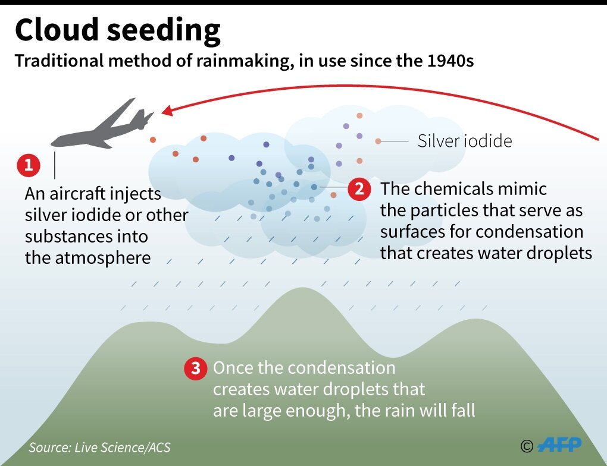

***

# Prerequisites

Load the libraries with R:
```{r}
library(randtests)
library(moments)
library(outliers)
library(EnvStats)
```

***

# Section Example: Cloud seeding to increase rainfall

Cloud seeding is the process where substances like dry ice and silver iodide are put into clouds in an attempt to make precipitation fall. Cloud seeding has also been used to dissipate fog and weaken some storms. [^1]

[^1]: [Source](https://dekhnews.com/wp-content/uploads/2016/11/cloud-seeding.png)



The case study in 3.1 [RS] provides an example of cloud seeding. Rainfall (acre-feet) was measured before and after the seeding. See page `59-60` for more.

+ Rainfall from Unseeded Days (n=26):

`1202.6, 830.1, 372.4, 345.5, 321.2, 244.3, 163.0, 147.8, 95.0, 87.0, 81.2, 68.5, 47.3` 

`41.1, 36.6, 29.0, 28.6, 26.3, 26.0, 24.4, 21.4, 17.3, 11.5, 4.9, 4.9, 1.0`

+ Rainfall from Seeded Days (n=26):

`2745.6, 1697.1, 1656.4, 978.0, 703.4, 489.1, 430.0, 334.1, 302.8, 274.7, 274.7, 255.0` 

`242.5, 200.7, 198.6, 129.6, 119.0, 118.3, 115.3, 92.4, 40.6, 32.7, 31.4, 17.5, 7.7, 4.1`

Did cloud seeding have an effect on rainfall in this experiment? If so, how much?

***

# Independence

The *Wald–Wolfowitz runs test* (or simply *runs test*) is a non-parametric statistical test that checks a **randomness** hypothesis for a two-valued (binary) data sequence. More precisely, it can be used to test the hypothesis that the elements of the sequence are mutually **independent**. 

For a sample, it is converted to a binary data sequence by taking the data in the given order and marking with `+` the data greater than the median, and with `–` the data less than the median. This is why the method is also called *runs above-and-below the median test*.

The null and alternative hypotheses of the runs test are:

+ H0: The data was produced in a random manner

+ H1: The data was not produced in a random manner

In R, the runs test is done with the `runs.test()` function from the `randtests` library:

```{r}

# Create a sample
Sample1 <- c(12, 16, 16, 15, 14, 18, 19, 21, 13, 13, 12, 16, 16, 15, 14)

# Perform Runs test
runs.test(Sample1)

# Make a new sample, 
# where the second half is correlated with the first half
Sample2 <- c(Sample1,Sample1*2)

# Perform Runs test
runs.test(Sample2)
```

***

# Normality

Even though we have been emphasizing that normality is the key assumption of t-tools ([one-sample](https://zhu-group.github.io/ese335/S07.html#One_sample_t-test), [independent two-sample](https://zhu-group.github.io/ese335/S08.html#Independent_two-sample_t-test), and [paired samples](https://zhu-group.github.io/ese335/S09.html#The_paired_sample_t-test)). It turns out t-tools are **very robust** to samples from non-normal populations, as long as the sample sizes are reasonably large (> `50`, this is arbitrary, but generally should be larger than `30`). To test this, run the following R scripts:

```{r}
# Total simulations
Total_simulations <- 1000

# Population 1, form a log normal distribution
pop1 <- rlnorm(4000, 1, 0.2)
shapiro.test(pop1)
skewness(pop1)

# Population 2, form a log normal distribution
pop2 <- rlnorm(4000, 2, 2)
shapiro.test(pop2)
skewness(pop2)

# Sample size
N1 <- 100
N2 <- 100

# List to store p-value
p_value <- c()

# Run simulation
for(i in 1:Total_simulations){
  # Sample 1
  s1 <- sample(pop1,N1)
  # Sample 2
  s2 <- sample(pop2,N2)
  # Do t-test, despite of the normality
  p_value <- c(p_value, t.test(s1,s2,var.equal=T)$p.value)
}

# Check the robustness
length(which(p_value<0.05))/Total_simulations
```

For small samples, t-tools are also robust if the skewness in the populations differs not too much.

```{r}
# Population 1, form a log normal distribution
pop1 <- rlnorm(4000, 1, 0.2)
skewness(pop1)

# Population 2, form a log normal distribution
pop2 <- rlnorm(4000, 2, 0.6)
skewness(pop2)

# Sample size
N1 <- 10
N2 <- 20

# List to store p-value
p_value <- c()

# Run simulation
for(i in 1:Total_simulations){
  # Sample 1
  s1 <- sample(pop1,N1)
  # Sample 2
  s2 <- sample(pop2,N2)
  # Do t-test, despite of the normality
  p_value <- c(p_value, t.test(s1,s2,var.equal=T)$p.value)
}

# Check the robustness
length(which(p_value<0.05))/Total_simulations
```

**The bottom line is:** 

When the skewness in the populations differs too much **and** the sample sizes are small, the t-tools are not robust, thus may result in misleading outputs.

```{r}
# Total simulations
Total_simulations <- 1000

# Population 1, form a log normal distribution
pop1 <- rlnorm(4000, 1, 0.2)
skewness(pop1)

# Population 2, form a log normal distribution
pop2 <- rlnorm(4000, 2, 2)
skewness(pop2)

# Sample size
N1 <- 10
N2 <- 20

# List to store p-value
p_value <- c()

# Run simulation
for(i in 1:Total_simulations){
  # Sample 1
  s1 <- sample(pop1,N1)
  # Sample 2
  s2 <- sample(pop2,N2)
  # Do t-test, despite of the normality
  p_value <- c(p_value, t.test(s1,s2,var.equal=T)$p.value)
}

# Check the robustness
length(which(p_value<0.05))/Total_simulations
```

***

# Equal variance of populations

## Welch t-ratio

The [independent two-sample t-test](https://zhu-group.github.io/ese335/S08.html#Independent_two-sample_t-test) requires the two populations to have the same variance, and sample SD s~1~ and s~2~ are independent estimates. However, such an assumption is not necessarily the case in reality. One may employ the individual sample SD as separate estimates of their respective population standard deviations, rather than polling to obtain a single estimate of a population SD. The standard error of the difference in two population means is then:

$$ SE(\overline{X_1} - \overline{X_2}) =  \sqrt { \frac{s_1^2} {n_1} + \frac{s_2^2} {n_2} }   $$
This ends up the *Welch t-ratio*:

$$t=\frac { (\overline{X_1} - \overline{X_2} ) - (\mu_1 - \mu_2) } { \sqrt { \frac{s_1^2} {n_1} + \frac{s_2^2} {n_2} } } $$

which approximately follows a t-distribution with d.f.~W~ degrees of freedom:

$$ d.f._W =  \frac {SE_W^4(\overline{X_1} - \overline{X_2})} { \frac{SE^4(\overline{X_1})} {n_1-1} + \frac{SE^4(\overline{X_2})} {n_2-1}  }   $$
where $SE(\overline{X_1})=\frac {s_1}{\sqrt{n_1}}$ and $SE(\overline{X_2})=\frac {s_2}{\sqrt{n_2}}$. 

## Welch two-sample t-test

Let's use the observations again, but now we have no information about the population SDs. Therefore, we need to conduct an independent two-sample t-test. 

+ H0: Mean PM2.5 level in Shenzhen is the same as that in Guangzhou ($\mu_1 = \mu_2$)

+ H1: Mean PM2.5 level in Shenzhen is not the same as that in Guangzhou ($\mu_1 \ne \mu_2$)

In this case, $\overline X_1 - \overline X_2$ is `-2.32`, $SE(\overline{X_1} - \overline{X_2})$ is `0.93`, assuming H0 is true ($\mu_1 - \mu_2 = 0$), we have $t$=`-2.48`.

Then the p-value can be calculated manually:

```{r}

# Shenzhen 
SZ_PM2.5  <- c(25.6, 23.7, 21.9, 26.0, 24.5, 22.4, 26.7, 24.6, 22.7, 23.8)

# Guangzhou
GZ_PM2.5  <- c(27.1, 24.2, 27.9, 33.3, 26.4, 28.7, 25.6, 23.2, 24.0, 27.1, 26.2, 24.4)

# Sample difference
mean(SZ_PM2.5) - mean(GZ_PM2.5)

# Get sample size, degrees of freedom, and sd
n1        <- length(SZ_PM2.5)
df1       <- n1 - 1
sd1       <- sd(SZ_PM2.5)

n2        <- length(GZ_PM2.5)
df2       <- n2 - 1
sd2       <- sd(GZ_PM2.5)

# SE of the difference
SE        <- sqrt( sd1^2/n1 + sd2^2/n2 )

# d.f.W
df        <- SE^4/( (sd1/sqrt(n1))^4/(n1-1) + (sd2/sqrt(n2))^4/(n2-1) )

# Get t-ratio
t         <- (mean(SZ_PM2.5) - mean(GZ_PM2.5))/SE

# Find the two-side p-value
# The pt function gives the Cumulative Distribution Function (CDF) 
# of the Student's t distribution in R, which is the probability that 
# the variable takes a value lower or equal to a threshold (here |t|).
P_value  <- (1-pt(abs(t), df=df))*2

print(P_value)
```
Now, we have a probability of about `2.30%` getting a statistic ($t$) as extreme or more extreme than the observed statistic (`-2.48`), assuming H0 is true. This is a small probability, and is likely due to chance. We can reject H0 given the observations. Thus, the mean PM2.5 level in Shenzhen is not the same as that in Guangzhou.

## Welch two-sample t-test with R

In R, you can simply conduct the previous independent two-sample t-test as:

+ H0: Mean PM2.5 level in Shenzhen is the same as that in Guangzhou ($\mu_1 = \mu_2$)

+ H1: Mean PM2.5 level in Shenzhen is not the same as that in Guangzhou ($\mu_1 \ne \mu_2$)

In R, this is done by:

```{r}

# Shenzhen 
SZ_PM2.5  <- c(25.6, 23.7, 21.9, 26.0, 24.5, 22.4, 26.7, 24.6, 22.7, 23.8)

# Guangzhou
GZ_PM2.5  <- c(27.1, 24.2, 27.9, 33.3, 26.4, 28.7, 25.6, 23.2, 24.0, 27.1, 26.2, 24.4)

# Call t.test function
# Since H1 states a different PM2.5 value in Shenzhen, 
# we need to compute the two-sided p-value
t.test(SZ_PM2.5, GZ_PM2.5, alternative="two.sided", var.equal=F)
```

Here we set `var.equal = F` when call the `t.test()` function. By doing so, we assume an "unequal SD" method. By default, R uses this "unequal SD" method.

***

# Outliers

An outlier is a value or an observation that is distant from other observations, or, a data point that differs significantly from other data points. Since the t-tools are based on average, they are not resistant to outliers. One or two outliers may affect a confidence interval or change a p-value enough to alter a conclusion completely.

We previously checked outliers by looking at histogram, boxplot, and `1.5*IQR` of the data. In this sub-section, we present 4 more formal techniques to detect outliers.

## Grubbs' test

*Grubbs' test* allows detecting whether the highest or lowest value in a dataset is an outlier. The test detects one outlier at a time (highest or lowest value). Note that Grubbs' test is not appropriate for a sample size of `6` or less.

If we want to test the highest value, the null and alternative hypotheses are as follows:

+ H0: The highest value is not an outlier

+ H1: The highest value is an outlier

If we want to test the lowest value, the null and alternative hypotheses are as follows:

+ H0: The lowest value is not an outlier

+ H1: The lowest value is an outlier

To perform Grubbs' test in R, use the `grubbs.test()` function from the `outliers` package:

```{r}
# Sample
Sample1 <- c(0.2, 0.8, -2.0, -7.0, -0.8, 0.8, 0.9, -1.1, -1.3, -0.3, 1.6, 8.3)

# Test for the highest value with Grubbs' test
grubbs.test(Sample1)

# Test for the lowest value with Grubbs' test
grubbs.test(Sample1,opposite = T)
```
## Dixon's test

Similar to the Grubbs' test, *Dixon's test* is used to test whether a single low or high value is an outlier. Dixon's test is more conservative than the Grubbs' test, and is most useful for a small sample size (usually less than `25`).

To perform Dixon's test in R, use the `dixon.test()` function from the `outliers` package. 

```{r}
# Test for the highest value with Dixon's test
dixon.test(Sample1)

# Test for the lowest value with Dixon's test
dixon.test(Sample1,opposite = T)
```
## Rosner's test

*Rosner's test* is used to detect **several outliers** at once (unlike Grubbs' and Dixon's test, which must be performed iteratively to screen for multiple outliers), and is designed to avoid the problem of masking, where an outlier that is close in value to another outlier can go undetected. Rosner's test is most appropriate when the sample size is large (large than `20`).

To perform Rosner's test we use the `rosnerTest()` function from the `EnvStats` package. This function requires at least `2` arguments: the data and the number of suspected outliers `k` (with `k = 3` as the default number of suspected outliers).

```{r}
# New Sample
Sample2 <- c(-0.4, 0.6, -0.6, 0.2, -7.0, -0.8, 0.6, -0.3, -1.3, 1.4, 
             -0.8, -1.2, 1.4, -0.5, -0.5, -1.2, -0.8, -2.5, 0.1, 
             -1.7, 0.6, 0.3, -2.3, 0.6, -0.1, 0.3, 8.3)

# Test for the highest value with Rosner's test
# number of suspected outliers is 2 (k=2)
rosnerTest(Sample2, k=2)
```
## Walsh's test

*Walsh's test* is a non-parametric test to detect multiple outliers in a data set. This test requires a large sample size (n > `220` for a significance level of `0.05`), it can be used whenever the data are normally distributed or not. 

```{r}

# Walsh's Outlier Test
# Details see:
# http://www.statistics4u.com/fundstat_eng/ee_walsh_outliertest.html

walsh.test <- function(data, k, alpha, opposite=F){
  
  # Sample size
  n    <- length(data)
  
  # sorted data
  data_new <- sort(data)
  
  # Get parameters
  c    <- ceiling(sqrt(2*n))
  p    <- k + c
  b2   <- 1/alpha
  a    <- (1+sqrt(b2)*sqrt((c-b2)/(c-1)))/(c-b2-1)
  
  # Test
  if(opposite){
    # Test for the low values
    print("Walsh's test of low values")
    w    <- data_new[k]-(1+a)*data_new[k+1]+a*data_new[p]
    if( w <0 ){
      print(paste("The lowest",k,"values are outlier:"))
      print(data_new[1:k])
    }
  }else{
    # Test for the high values
    print("Walsh's test of high values")
    w    <- -1*data_new[n+1-k]+(1+a)*data_new[n-k]+a*data_new[n+1-p]
    if( w < 0 ){
      print(paste("The highest",k,"values are outlier:"))
      print(data_new[(n+1-1):(n+1-k)])
    }
  }
}

# Perform Walsh's test
sample <- c(runif(250,0,1), -90, -91, -100, 90, 91, 100)

# Test for the 3 highest values
walsh.test(sample, k=3, alpha = 0.05)

# Test for the 3 lowest values
walsh.test(sample, k=3, alpha = 0.05,opposite=T)
```

## Summary of tests to detect outliers

Below is a brief summary of proceeding `4` tests:

Test           |Normal population |Sample size    |Detect several outliers | R function     |R Package |
|:------------:|:----------------:|:-------------:|:----------------------:|:--------------:|:--------:|
|Grubbs' test  |Yes               |$n \ge 6$      | No                     | `grubbs.test()`|`outliers`|
|Dixon's test  |Yes               |$n \le 25$     | No                     | `dixon.test()` |`outliers`|
|Rosner's test |Yes               |$n \ge 20$     | Yes                    | `rosnerTest()` |`EnvStats`|
|Walsh's test  |No                |$n \ge 220 ^*$ | Yes                    | `walsh.test()` | [See above](https://zhu-group.github.io/ese335/S10.html#Outliers)     |
$^*$For a significant level of $\alpha$, $Trunc(\sqrt{2n})>1+\frac {1} {\alpha}$, where $Trunc()$ returns the ceiling.

## Dealing with outliers

Once outliers are identified, one needs to adopt the careful examination strategy. See Display 3.6 (page `69`) in [RS] for more. 

***

# In-class exercises

## Exercise #1

Use different methods to remove outliers in the following observations:

`-4.44, -1.41, -0.78, -0.78, 0.55, 0.64, 1.05, 1.05, 1.72, 5.91, 9.30, 20.49`

## Exercise #2

A local environmental officer wants to compare two fields to see if there are any differences in Cd concentrations. From field A, the officer randomly collected `20` samples, and Cd concentration (mg kg^-1^) is measured as follows:

`8.52, 5.91,  4.97, 5.02,  9.92,  20.12, 4.34,  4.35,  7.39,  4.74, 5.17, 10.65,  9.76`  

`6.70,  8.37,  3.61,  4.44,  15.29, 7.15, 10.07`

From field B, the officer randomly collected `13` samples with  Cd concentrations read as:

`6.38, 10.59, 11.63, 18.62, 13.60,  6.60,  15.10, 12.31, 9.62,  9.00,  6.42,  4.81,  8.25`  

+ 2.1 Check the independence of samples

+ 2.2 Plot two boxplots side by side, are there any potential outliers?

+ 2.3 Use different methods to test the potential outliers

+ 2.4 Check the normality of the two samples, is the t-test suitable here?

+ 2.5 Do you use the independent two-sample or Welch two-sample t-test?

+ 2.6 What is the H0 and H1?

+ 2.7 Do you use a one-sided or two-sided p-value?

+ 2.8 Adopt the careful examination strategy, do the analyses give the same answer to the question of interest?

+ 2.9 Report your findings