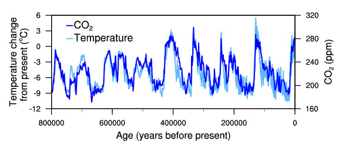

***

# Prerequisites

Load the libraries with R:
```{r}
library(randtests)
library(outliers)
```

***

# Section Example: Temperature Change and Carbon Dioxide Change

  
[Figure Source](https://www.ncdc.noaa.gov/global-warming/temperature-change)

One of the most remarkable aspects of the paleoclimate record is the strong correspondence between temperature and the concentration of CO~2~ in the atmosphere observed during the glacial cycles of the past several hundred thousand years. When CO~2~ concentration goes up, temperature goes up; when CO~2~ concentration goes down, temperature goes down. Or in other words, CO~2~ *correlates* with temperature. 

The correspondence shown in the figure is actually not very strightforwad - it's not simply because rising temperature leads to higher CO~2~ or the other way around. Part of the *correlation* is due to the relationship between temperature and the solubility of carbon dioxide in the surface ocean, and part is due to a feedback between carbon dioxide and climate. These changes are expected if Earth is in radiative balance, and they are consistent with the role of greenhouse gases in climate change. Furthermore, other changes are involved in the glacial climate, including altered vegetation, land surface characteristics, and ice sheet extent.

The idea of this example is to show you: **correlation not necessarily means causality**.

***

# Covariance

We mainly examined one variable in the proceeding sections - comparing population means, independence test, or normality checking. We will start to look at how observations from more than one variable since this section. More importantly, we are interested in the **relationship** between/among variables. 

Before diving deeper, we need to understand how to describe the relationship between a pair of variables. In statistics, *covariance* is a measure of how much two random variables **vary together**. If the variables tend to show similar behavior, the covariance is positive. In the opposite case, if the variables tend to show opposite behavior, the covariance is negative. So, the sign of the covariance shows the tendency in the **linear** relationship between the variables. 

The covariance between two random variables *X* and *Y* can be calculated using the following formula (for population):

$$\sigma_{XY}= \frac{\sum_{i}^{N} (x_i - \mu_X)(y_i - \mu_Y)} {N} $$

The covariance between two random variables *X* and *Y* can be calculated using the following formula (for sample):

$$s_{xy}= \frac{\sum_{i}^{n} (x_i - \overline{x})(y_i - \overline{y})} {n-1} $$

The magnitude of the covariance is not easy to interpret because it is not normalized and hence depends on the magnitudes of the variables. For example:

```{r}

# Make up some random values
x <- rnorm(10,0,1)
y <- 10*x+rnorm(10,0.2,0.5)

# Plot
# 1 row 2 cols plot
par(mfrow=c(1,2))

# Plot original data
plot(x,y)

# Double x and y 
plot(2*x,2*y)

# Compute covariance
cov(x,y)
cov(2*x,2*y)
```

As you can see, covariance provides only **direction** of the relationship. However, it does not indicate the **strength** of the relationship.

***

# Correlation

*Correlation* measures the strength of the relationship between variables. Correlation is the scaled measure of covariance. It is **dimensionless**, ranging between `-1` and `+1`.

The *Pearson correlation coefficient*, also referred to as Pearson's r, the Pearson product-moment correlation coefficient, is a measure of *linear correlation* between two sets of data. Given **jointly normal** *X* and *Y*, the formula for Pearson correlation coefficient for the population is:

$$\rho = \frac{COV(X,Y)} {\sigma_{X} \sigma_{Y} }  $$
The formula for Pearson correlation coefficient for the sample is:
 
$$r_{xy} = \frac{s_{xy}} {s_x s_y }  $$

Or:

$$r_{xy} = \frac{\sum_{i}^{n} (x_i - \overline{x})(y_i - \overline{y})} {\sqrt{\sum_{i}^{n} (x_i - \overline{x})^2} \sqrt{\sum_{i}^{n} (y_i - \overline{y})^2} }   $$
In theory, if (*X*,*Y*) follows a bivariate normal:

$$\frac {r \sqrt{n-2}}{\sqrt{1-r^2}} \sim t_{df=n-2}$$

With this, we know p-value is the chance that randomness results in a correlation as extrme or more extreme than the observed correlation. We can test the significance of the observed Pearson correlation coefficient by comapring the p-value with a certain significant level.

***

# Pearson correlation test procedure

## 1 Check data

As a parametric method, Pearson correlation has the assumptions of independence of observations and normally distributed dependent variable. So checking those assumptions is the first step of the correlation test. That is:

+ Visual checking: outliers and linearity

+ Statistical test: independence, normality, and outliers

```{r}

# Make up some random values
x <- rnorm(20,0,1)
y <- 2*x+rnorm(20,0,0.5)

# Scatter plot
plot(x,y)

# Check independence of the dependent variable
runs.test(x)
runs.test(y)

# Check normality
# Sample size < 30, use the Shapiro-Wilk test
shapiro.test(x)
shapiro.test(y)

# Check outliers
grubbs.test(x)
grubbs.test(y)
```

## 2 Write down H0 and H1

For Pearson correlation test:

+ H0: The two variables have no correlation ($\rho = 0$)

+ H1: The two variables have correlation ($\rho \ne 0$)

The H1 may be different depending on your research question ($\rho \ne 0$, $\rho < 0$, or $\rho > 0$).

## 3 Pearson correlation test

In R, call the `cor.test()` function to perform Pearson correlation test.

```{r}
cor.test(x, y, method="pearson", alternative="two.sided", conf.level=0.95)
```

Here the method is set to `pearson`, H1 as `two.sided`, and a significant level of `0.95` (default value used by R). 

## 4 Report the results

Figure out whether the Pearson correlation coefficient is significant or not. Notice that, you could get a significant but very weak correlation, often depending on the sample size.


***


# In-class exercises

## Exercise #1

In R, make up two samples:

```{r, eval=F}
# Make up two samples
x <- c(0.1, -1.6, -2.3,  0.1,  0.1,  0.5, -0.3, -0.3, 1.4,  0.3)
y <- 2*x+c(-0.4, -0.4, -0.4,  0.2, -1.6,  0.2,  0.2,  0.6,  0.2, 1.1)

# Add one outlier
x <- c(x, -20)
y <- c(y, 30)

# Uncomment the following lines to remove the outlier
# x <- x[- 11] 
# y <- y[- 11] 
```

+ Compute the Pearson correlation coefficient between `x` and `y`. 

+ Now remove the outlier `(-20,30)`, compute the Pearson correlation coefficient between `x` and `y`. 

+ Can you explain the impact of the outlier on the Pearson correlation coefficients?

## Exercise #2

In R, make up two samples:

```{r}
# Make up samples
x1 <- c(0.1, -1.6, -2.3,  0.1,  0.1,  0.5, -0.3, -0.3, 1.4,  0.3)
y1 <- 2*x1+c(-0.4, -0.4, -0.4,  0.2, -1.6,  0.2,  0.2,  0.6,  0.2, 1.1)
x2 <- x1-5.0
y2 <- -1.0*y1

x <- c(x1,x2)
y <- c(y1,y2)
```

+ Compute the Pearson correlation coefficient between `x1` and `y1`. 

+ Compute the Pearson correlation coefficient between `x2` and `y2`. 

+ Compute the Pearson correlation coefficient between `x` and `y`. 

+ Can you explain why the Pearson correlation coefficients differ in the three cases?

## Exercise #3

A researcher wants to study the correlation between Total organic carbon (TOC) and UV absorption around `240` nm. The researcher makes `12` water samples from different lakes, and measures the corresponding TOC and UV absorption as follows: 

TOC: `1.59, 1.79, 1.00, 0.45, 3.84, 2.30, 1.00, 3.20, 0.80, 2.20, 3.20, 2.10`

UV: `0.144, 0.152, 0.113, 0.025, 0.227, 0.149, 0.014, 0.158, 0.042, 0.154, 0.173, 0.095`

Based on the observations, is there a correlation between TOC and UV absorption? Report your results.