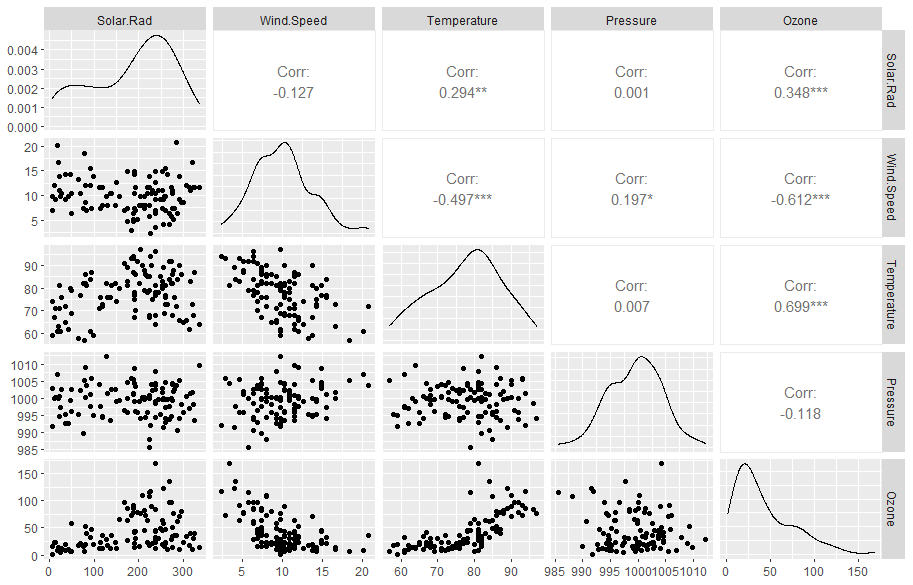

***

# Prerequisites

Load the libraries with R:
```{r}
library(ggplot2)
library(GGally)
library(olsrr)
```

***

# Section example: Surface ozone and meteorological factors

 

[Photo source](https://www.climatecentral.org/climate-matters/ozone-pollution-the-good-the-bad-and-the-dirty)

Ozone (O~3~) occurs both in the Earth's upper atmosphere and at ground level. **Ozone can be good or bad**, depending on where it is found. Called stratospheric ozone, good ozone occurs naturally in the upper atmosphere, where it forms a protective layer that shields us from the sun's harmful ultraviolet rays. Ozone at ground level, however, is a harmful air pollutant, because of its effects on people and the environment, and it is the main ingredient in smog. Check [ozone facts from EPA](https://www.epa.gov/ground-level-ozone-pollution/ground-level-ozone-basics) for more.

Ozone is produced when nitrogen oxides and volatile organic compounds react. Meteorological conditions also govern ozone levels. Here we use observations to examine the relationship between ozone and several meteorological factors, including solar radiation, wind speed, temperature, and surface pressure. The data set is [available here](https://zhu-group.github.io/ese335/download/ozone_data.csv).

Load the observations via:

```{r}
# Read ozone and meteorological data
Ozone_data <- read.csv(file = "ozone_data.csv", header=T)

# Check the data
str(Ozone_data)
```

***

# Multiple linear regression basics

## The model

You can consider the multiple linear regression as an extended simple linear regression. But now, we have **more than one independent variables** (*X~1~*,*X~2~*, ..., *X~k~*) and **one dependent variable** (*Y*). The multiple linear regression model goes as follow:

$$Y= \beta_0 + \beta_1 X_1 + \beta_2 X_2 + ... + \beta_k X_k + \epsilon $$
Here the coefficient (e.g., $\beta_k$) is interpreted as the estimated mean change in the dependent variable *Y* corresponding to one unit change in the independent variable (i.e., $X_k$), **when all other variables remain the same**.

The assumptions are the same as those of simple linear regression - existence, independence of *Y*, linearity, homoscedasticity, and normality of residuals. In fact, the complexity of multiple linear regression is not from the model fitting, but rather from the selection of independent variables. The ideal is to have enough (not more) independent variables to be correlated with the dependent variable, but not with each other.

## Multicollinearity

Since we are dealing with more than one independent variables in multiple linear regression, it is very likely that one independent variable correlates with another variable. For example, you will find temperature correlates significantly (*r*=`-0.46`) with wind speed in the section example. 

```{r, eval=F}
# Plot scatter plots
ggpairs(Ozone_data,columns=1:5)
```

 


*Multicollinearity* in a multiple regression model indicates that collinear independent variables are related in some fashion. In other words, multicollinearity can exist when two independent variables are highly correlated. It can also happen if an independent variable is computed from other variables in the data set or if two independent variables provide similar and repetitive results (called redundant variable). 

## Overfitting

*Overfitting* means the model contains more parameters than can be justified by the data. In this case, your model begins to describe the random error in the data rather than the relationships between variables. For example, pressure is not significantly correlated with ozone in the section example. This means pressure may bring not much new additional information (called irrelevant variable). Overfitting can produce misleading R^2^, regression coefficients, and p-values.

***

# Variable selection

Variable selection in multiple regression is the **hardest** part of model building. The purpose of variable selection to identify the **best** subset of predictors among many variables to include in a model. The issue is how to find the necessary variables among the complete set of variables by deleting both irrelevant variables (variables not affecting the dependent variable), and redundant variables (variables not adding anything to the dependent variable). Many variable selection methods exist. Each provides a solution to one of the most important problems in statistics. Check [Variable Selection in Multiple Regression](https://advstats.psychstat.org/book/mregression/selection.php) and Ch. 12 (*Strategies for variable Selection*) of [RS] for more.

The general theme of the variable selection is to examine certain subsets and select the best subset, which either maximizes or minimizes an **appropriate criterion**. More specifically, a model selection method usually should include the following three components:

+ Select a test statistic

+ Select a criterion for the selected test statistic

+ Make a decision on removing/keeping a variable

## Statistic for variable selection

### P-value

If a predictor is significant, it can be included in a regression model. 

### R^2^ or adjusted R^2^ 

If a predictor can contribute significantly to the overall R^2^ or adjusted R^2^, it should be considered to be included in the model. 

### Mallows' Cp

This one is widely used in variable selection. 

$$C_p = \frac {SSE_p} {MSE_k} - n + 2(p+1) $$
where *SSE~p~* is the sum of squared errors for the model with *p* independent variables and *MSE~k~* is the mean squared residuals for the model with all *k* independent variables, *n* is sample size. We look for a subset of variables with $C_p \le p+1$, where *p* is the number of independent variables. If *C~p~* is much bigger than *p+1*, this indicates a bad fit. 

### AIC

Akaike Information Criterion (AIC) measures a trade-off between the goodness of model fit (*SSE*) and model complexity (*p*). With more independent variables in a regression model, *SSE* typically would become smaller or at least the same, and therefore the first part of AIC becomes smaller. However, with independent variables, the model would become more complex, and therefore the second part of AIC becomes bigger. 

$$AIC = n \mathrm {ln}(\frac {SSE} {n}) + 2p$$

### BIC

Bayesian information criteria (BIC) is a variant of AIC with a stronger penalty for including additional variables in the model. The **lower** the BIC, the better the model.

$$BIC = n \mathrm {ln}(\frac {SSE} {n}) + p \mathrm {ln}(n)$$

### Occam's razor

If all the above statistics are close, and it's hard to choose from two models, use the one with *fewer* independent variables.

## All possible subsets approach

The basic idea of the all possible subsets approach is to run **every possible** combination of independent variables to find the best subset to meet some pre-defined objective criteria. In R, you can use the `ols_step_all_possible` function from `olsrr` package to test all possible subsets of the set of potential independent variables.

```{r}
# Fit the full model, where all independent variables are included 
full_model  <- lm(Ozone ~ Solar.Rad + Wind.Speed + Temperature + Pressure, data = Ozone_data)

# Test all possible subsets
output      <- ols_step_all_possible(full_model)

# Print results from all possible subsets
output

# Plot results from all possible subsets
plot(output)
```

## All best subsets approach

This approach selects the best-fitted model as a certain number of variables are included. We can then select the overall best model by comparing the statistics among those models.

In R, you can print the best fitted models with the `ols_step_best_subset()` function:

```{r}
ols_step_best_subset(full_model)
```

In this case, we will choose model `#3` as it has the highest adjusted R^2^, lowest AIC, and a $C_p \le 3+1$.  

## Auto selection

### Backward elimination

Backward elimination begins with a model which includes all candidate variables (so-called full model). Variables are then deleted from the model one by one until all the variables remaining in the model are significant and exceed certain criteria. At each step, the variable showing the smallest improvement to the model is deleted. Once a variable is deleted, it cannot come back to the model.

Backward elimination works well if you have a modest-sized set of potential variables from which you wish to eliminate a few – i.e. if you're fine-tuning some prior selection of variables–you should generally go backward.

In R, this is done with the `ols_step_backward_aic()` function:

```{r}
ols_step_backward_aic(full_model, details=F)
```

Here we remove the pressure variable from the full model.

### Forward selection

Forward selection begins with a model which includes no predictors (the intercept-only model, so-called null model). Variables are then added to the model one by one until no remaining variables improve the model by a certain criterion. At each step, the variable showing the biggest improvement to the model is added. Once a variable is in the model, it remains there.

Forward selection works well if you have a very large set of candidate predictors from which you wish to extract a few.

In R, this is done with the `ols_step_forward_aic()` function:

```{r}
ols_step_forward_aic(full_model, details=F)
```

Here we include temperature, wind speed, and solar radiation one by one, each at a step.

### Stepwise regression

Stepwise regression is a combination of both backward elimination and forward selection methods. The stepwise method is a modification of the forward selection approach and differs in that variables already in the model do not necessarily stay. As in forward selection, stepwise regression adds one variable to the model at a time. After a variable is added, however, stepwise regression checks all the variables already included again to see whether there is a need to delete any variable that does not provide an improvement to the model based on a certain criterion.

In R, this is done with the `ols_step_both_aic()` function:

```{r}
ols_step_both_aic(full_model, details=F)
```

The final model includes temperature, wind speed, and solar radiation.

***

# Making predictions with the model

Once the best model is selected, we can use it to predict mean and individual response. Here the R functions are the same as we saw in the simple linear regression.

```{r}
# Best model
reg <- lm(Ozone ~ Solar.Rad + Wind.Speed + Temperature , data = Ozone_data)
summary(reg)
```

```{r, eval=F}
# Make confidence band
predict(reg, interval="confidence", level=0.95)
```

```{r, eval=F}
# Make prediction band
predict(reg, interval="prediction", level=0.95)
```

***

## Procedure of the multiple linear regression

## 1 Check data

+ Statistical test: independence of Y and possible outliers

+ Visual checking: high correlation between dependent variable and independent variable, low correlation among independent variables. The goal is to remove irrelevant and redundant variables.

## 2 Write down H0 and H1

For multiple linear regression, H0 could be different depending your questions. For example, if the goal is to determine whether there is a linear relationship, H0 is then:

$$\beta_1 = \beta_2 = ... = \beta_k = 0$$
Here we test the overall model. If the goal is to test a specific slope, H0 would be:

$$\beta_i = 0$$

Here we test the change with and without such specific slope.

## 3 Find the best model

The rule is to find a model with higher adjusted R^2^, lower AIC, and a $C_p \le p+1$ (*p* being the number of independent variables included in the model).  

## 4 Check residuals

```{r}
par(mfrow = c(2, 2))
plot(reg)
par(mfrow = c(1, 1))
```

Here in the residuals vs. fitted plot, we see a roughly horizontal line is expected (linearity checked). In the Scale-location plot, we also see a roughly horizontal line (homoscedasticity checked). Finally, the residuals are following a normal distribution by examining the normal Q-Q plot (normality checked). 

## 5 Report the results

+ A brief description of the variables you used

+ Report the slope, intercept, R^2^, and adjusted R^2^

+ Report predictions if necessary

***

# In-class exercises

## Exercise #1

In this exercise, we will learn the concept of *cross-validation* and how to use it to test the model. The goal of cross-validation is to test the model's ability to predict new data that was not used in estimating it, in order to flag problems like overfitting or selection bias and to give an insight on how the model will generalize to an independent dataset (i.e., an unknown dataset, for instance from a real problem). 

One round of cross-validation involves **partitioning a sample of data into complementary subsets**, performing the analysis on one subset (called the training set), and validating the analysis on the other subset (called the validation set). To reduce variability, in most methods, multiple rounds of cross-validation are performed using different partitions, and the validation results are combined (e.g., averaged) over the rounds to give an estimate of the model's predictive performance.

We will use the CPU performance data from the MASS package.

**1.1** Load the data `cpus` in the `MASS` package by:

```{r,eval=F}
library(MASS)
data(cpus)
```

**1.2** Use `85%` of the data points to form a training set, and the rest data points as the validation set

```{r,eval=F}
fraction        <- 0.85
sample_index    <- sample(nrow(cpus),nrow(cpus)*fraction)
cpus_training   <- cpus[sample_index,]
cpus_validation <- cpus[-sample_index,]
```

**1.3** Use the `ggpairs()` function to check the linear relationship between dependent variable `perf` and each independent variable (`syct`, `mmin`, `mmax`, `cach`, `chmin`, `chmax`) in `cpus_training`.

**1.4** Fit a regression model between dependent variable `perf` and all independent variables (`syct`, `mmin`, `mmax`, `cach`, `chmin`, `chmax`). What is the adjusted R^2^? Which independent variable(s) has an insignificant slope?

**1.5** Use the all possible subsets approach to find the best model. Please justify your selection.

**1.6** Use the all best subsets approach to find the best model. Please justify your selection.

**1.7** Use backward elimination approach to find the best model.

**1.8** Use forward selection approach to find the best model.

**1.9** Use stepwise regression approach to find the best model.

**1.10** Give your best linear model based on results from step `5-9`.

**1.11** Apply the best linear model model_from step `10` to `cpus_validation` subset, get the individual prediction of CPU performance (`perf`) using the `predict()` function. Compare predicted CPU performance with actual values in `cpus_validation` in terms of Pearson correlation coefficient and relative mean bias. 

**1.12** Use the linear model model_from step `10`,  repeat step `2` and `11` for `50` times. Each time, you will end up with different `cpus_training`, `cpus_validation`, Pearson correlation coefficient, and relative mean bias. Report the mean Pearson correlation coefficient and mean relative mean bias. Based on the cross-validation result, is the model a reliable one?
