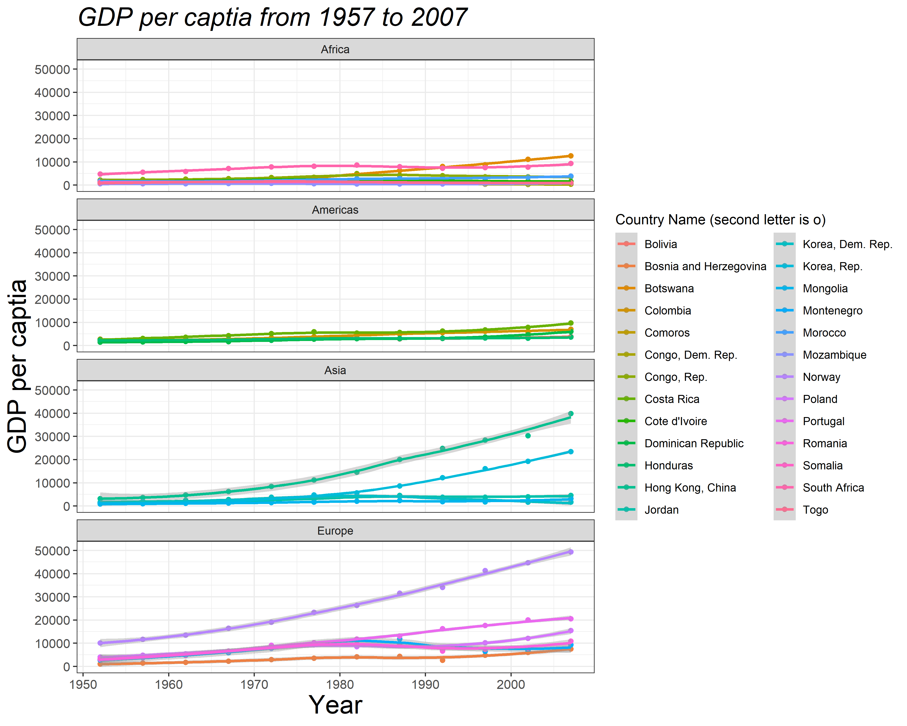

***

# Prerequisites

Load the libraries with R:

```{r}
library(dplyr)
library(ggplot2)
library(gapminder)
```

***

*This section is modified from the excellent [Data visualisation](https://r4ds.had.co.nz/data-visualisation.html#introduction-1) and [How to make any plot in ggplot2?](http://r-statistics.co/ggplot2-Tutorial-With-R.html), both are freely available online.*

`ggplot2` is the most elegant and aesthetically pleasing graphics framework available in R. It implements the **grammar of graphics**, a coherent system for describing and building graphs. It can significantly improve your plots' quality and make you much more efficient in creating them. With that being said, the learning curve is steep because the way you make plots with `ggplot2` is very different from base graphics making in R and in other languages. The distinctive feature of the `ggplot2` framework is the way you make plots through **adding layers**. Here we will learn the steps of making a plot with `ggplot2`. More about `ggplot2`, check [How to make any plot in ggplot2?](http://r-statistics.co/ggplot2-Tutorial-With-R.html).

***

# Steps of plotting with `ggplot2`

## 1. Passing the data set

First of all, you need to tell R what data set to use in plotting. This is done by passing a *data.frame* object to the `ggplot()` function. Here the data frame object should contain **all** features needed to make the plot you want. Unlike base graphics in R and other languages, `ggplot()` does not take vectors as arguments.

In previous sections, you learn how to use the pipe operator (`%>%`) to pass a data set (`tibble` object) produced through [data wrangling](https://zhu-group.github.io/ese335/S05.html) to the `ggplot()` function. This is exactly what you need to do in this step. 

Let's use the `gapminder` data set. Now suppose we want to look at how GDP per capita (`gdpPercap`) changes from 1957 to 2007 for countries with names starting with the letter "C" in Asia or Europe. (I make up this subjective example, but hopefully, you can feel the power of the `dplyr` package!) We can then pass the subset of `gapminder` data to `ggplot` to make a scatter plot between `gdpPercap` and `year`. 

```{r}

# Make a simple scatter plot
gapminder %>%
  dplyr::filter( continent=="Asia" | continent=="Europe" ) %>%   
  dplyr::filter( substr(country,1,1)=="C" ) %>% 
  ggplot( aes(x=year, y=gdpPercap) ) + 
  geom_point()
```

## 2. Mapping the aesthetics

The plot above, however, can not distinguish countries as all points are plotted in the same manner. In fact, we would like to add `country` as the **third** variable to the two dimensional scatter plot. By doing so, we are mapping the scatter plot to an ***aesthetic***. An aesthetic is a visual property of the objects in your plot. Aesthetics include things like the `size`,  `shape`, `color`, or even transparency (`alpha`) of the points. You can display a point (like the one below) in different ways by changing the values of its aesthetic properties. 

```{r}

# Add an aesthetic - color
gapminder %>%
  dplyr::filter( continent=="Asia" | continent=="Europe" ) %>%   
  dplyr::filter( substr(country,1,1)=="C" ) %>% 
  ggplot( aes(x=year, y=gdpPercap, color=country) ) + 
  geom_point()

```

To map an aesthetic to a variable, associate the name of the aesthetic to the name of the variable inside `aes()`. `ggplot2` will automatically assign a unique level of the aesthetic (here a unique color) to each unique value of the variable, a process known as *scaling*. `ggplot2` will also add a *legend* that explains which levels correspond to which values.

In the above example, we mapped `country` to the `color` aesthetic, but we could have mapped `country` to the `size` aesthetic in the same way. In this case, the exact size of each point would reveal its class affiliation. 

```{r}

# Add an aesthetic - size
gapminder %>%
  dplyr::filter( continent=="Asia" | continent=="Europe" ) %>%   
  dplyr::filter( substr(country,1,1)=="C" ) %>% 
  ggplot( aes(x=year, y=gdpPercap, size=country) ) + 
  geom_point()

```

We get a warning here, because mapping an unordered variable (`country`) to an ordered aesthetic (`size`) is not a good idea. We can ignore the warning for now.

Similarly, we could map `country` to the `shape` or `alpha` aesthetic:

```{r}

# Add an aesthetic - shape
gapminder %>%
  dplyr::filter( continent=="Asia" | continent=="Europe" ) %>%   
  dplyr::filter( substr(country,1,1)=="C" ) %>% 
  ggplot( aes(x=year, y=gdpPercap, shape=country) ) + 
  geom_point()

# Add an aesthetic - transparency
gapminder %>%
  dplyr::filter( continent=="Asia" | continent=="Europe" ) %>%   
  dplyr::filter( substr(country,1,1)=="C" ) %>% 
  ggplot( aes(x=year, y=gdpPercap, alpha=country) ) + 
  geom_point()

```

You can even combine more than one aesthetic:

```{r}

# Add two aesthetics - color + shape
gapminder %>%
  dplyr::filter( continent=="Asia" | continent=="Europe" ) %>%   
  dplyr::filter( substr(country,1,1)=="C" ) %>% 
  ggplot( aes(x=year, y=gdpPercap, color=country, shape=country) ) + 
  geom_point()

```

```{r}

# Add two aesthetics - shape + size
gapminder %>%
  dplyr::filter( continent=="Asia" | continent=="Europe" ) %>%   
  dplyr::filter( substr(country,1,1)=="C" ) %>% 
  ggplot( aes(x=year, y=gdpPercap, color=country, shape=continent, size=country) ) + 
  geom_point()

```

Once you map an aesthetic, `ggplot2` takes care of the rest. It selects a reasonable scale to use with the aesthetic, and it constructs a legend that explains the mapping between levels and values.

## 3. Adding more geometric objects

In the previous steps, we make a scatter plot between `gdpPercap` and `year`. The plot uses a visual object to represent the data. In ggplot2 syntax, we say the plot uses a geometrical object or **geom**. 

People often describe plots by the type of geom that the plot uses. For example, bar charts use bar geoms, line charts use line geoms, boxplots use boxplot geoms, and so on. `ggplot2` provides over 40 geoms, and extension packages provide even more (see [here](https://exts.ggplot2.tidyverse.org/gallery/) for a sampling). The best way to get a comprehensive overview is [ggplot2 cheatsheet](https://nyu-cdsc.github.io/learningr/assets/data-visualization-2.1.pdf). To learn more about any single geom, use `?`, for example `?geom_smooth`.

In `ggplot2`, you can use "+" to add another geom to the plot. In the plot below, we add a smoothed line to the scatter plots from the individual country.

```{r}

# Use two geoms - point + smooth line
gapminder %>%
  dplyr::filter( continent=="Asia" | continent=="Europe" ) %>%   
  dplyr::filter( substr(country,1,1)=="C" ) %>% 
  ggplot( aes(x=year, y=gdpPercap, color=country) ) + 
  geom_point() + 
  geom_smooth()
```

## 4. Changing the labels

Now that you have drawn the main parts of the plot. You might want to add the plot’s main title and perhaps change the X and Y axis titles. This can be accomplished using the `labs` layer, meant for specifying the labels. However, manipulating the size, the color of the labels is the job of the ‘Theme’.

```{r}

# Change labels
gapminder %>%
  dplyr::filter( continent=="Asia" | continent=="Europe" ) %>%   
  dplyr::filter( substr(country,1,1)=="C" ) %>% 
  ggplot( aes(x=year, y=gdpPercap, color=country) ) + 
  geom_point() + 
  geom_smooth() +
  labs(title="GDP per captia from 1957 to 2007", x="Year", y="GDP per captia")
```

## 5. Adjusting the theme

Very often, we want to customize our plot to make it looks better. For example we may need to increase the size of the labels and/or change the legend title. Adjusting the size of labels can be done using the `theme()` function by setting the`plot.title`, `axis.text.x`, and `axis.text.y` option. They need to be specified inside the `element_text()`. If you want to remove any of them, set it to `element_blank()`, and it will vanish entirely. 

Adjusting the legend title is a bit tricky. If your legend is that of a `color` attribute and it varies based on a factor, you need to set the `name` using the `scale_color_discrete()` function, where the color part belongs to the color attribute and the **discrete** because the legend is based on a factor variable.

```{r}

# Change the theme
gapminder %>%
  dplyr::filter( continent=="Asia" | continent=="Europe" ) %>%   
  dplyr::filter( substr(country,1,1)=="C" ) %>% 
  ggplot( aes(x=year, y=gdpPercap, color=country) ) + 
  geom_point() + 
  geom_smooth() +
  labs(title="GDP per captia from 1957 to 2007", x="Year", y="GDP per captia") +
  theme_bw() +
  theme(plot.title=element_text(size=20, face="bold"), 
        axis.text.x=element_text(size=10), 
        axis.text.y=element_text(size=10),
        axis.title.x=element_text(size=20),
        axis.title.y=element_text(size=20)) + 
  scale_color_discrete(name="Country Name")
```

## 6. Using the facets

For categorical variables, it is particularly useful to split your plot into **facets**, subplots that each display one subset of the data. To facet your plot by a single variable, use `facet_wrap()`. The first argument of `facet_wrap()` should be a formula, which you create with `~` followed by a variable name. The variable that you pass to `facet_wrap()` should be discrete.

Let's split our plot into two facets based on `continent`:

```{r}

# Using the facets
gapminder %>%
  dplyr::filter( continent=="Asia" | continent=="Europe" ) %>%   
  dplyr::filter( substr(country,1,1)=="C" ) %>% 
  ggplot( aes(x=year, y=gdpPercap, color=country) ) + 
  geom_point() + 
  geom_smooth() +
  labs(title="GDP per captia from 1957 to 2007", x="Year", y="GDP per captia") +
  theme_bw() +
  theme(plot.title=element_text(size=20, face="bold"), 
        axis.text.x=element_text(size=10), 
        axis.text.y=element_text(size=10),
        axis.title.x=element_text(size=20),
        axis.title.y=element_text(size=20)) + 
  scale_color_discrete(name="Country Name") +
  facet_wrap( ~ continent)
```

One way to change the layout the facets is specifying `ncol` and `nrow` options in the `facet_wrap()` function:

```{r}

# Using the facets - 2 rows (2x1)
gapminder %>%
  dplyr::filter( continent=="Asia" | continent=="Europe" ) %>%   
  dplyr::filter( substr(country,1,1)=="C" ) %>% 
  ggplot( aes(x=year, y=gdpPercap, color=country) ) + 
  geom_point() + 
  geom_smooth() +
  labs(title="GDP per captia from 1957 to 2007", x="Year", y="GDP per captia") +
  theme_bw() +
  theme(plot.title=element_text(size=20, face="bold"), 
        axis.text.x=element_text(size=10), 
        axis.text.y=element_text(size=10),
        axis.title.x=element_text(size=20),
        axis.title.y=element_text(size=20)) + 
  scale_color_discrete(name="Country Name") +
  facet_wrap( ~ continent, nrow=2)
```

## 7. Saving the plot

Finally, you can save the above plot uisng the `ggsave()` function. The default is to save the last plot that you displayed, using the size of the current graphics device. It's smart enough to guess the type of graphics device from the extension. Let's save the above figure to a local path `D://ese335` with a name `myplot.png`:

```{r, eval=F}

# Save a ggplot figure
gapminder %>%
  dplyr::filter( continent=="Asia" | continent=="Europe" ) %>%   
  dplyr::filter( substr(country,1,1)=="C" ) %>% 
  ggplot( aes(x=year, y=gdpPercap, color=country) ) + 
  geom_point() + 
  geom_smooth() +
  labs(title="GDP per captia from 1957 to 2007", x="Year", y="GDP per captia") +
  theme_bw() +
  theme(plot.title=element_text(size=20, face="bold"), 
        axis.text.x=element_text(size=10), 
        axis.text.y=element_text(size=10),
        axis.title.x=element_text(size=20),
        axis.title.y=element_text(size=20)) + 
  scale_color_discrete(name="Country Name") +
  facet_wrap( ~ continent, nrow=2)
  ggsave("myplot.png")  # save a stored ggplot

```

You can also change the plot size (`width` and `height`) and resolution (`dpi`) by setting corresponding options. Use `?ggsave()` for more.

```{r,eval=F}

# Save a ggplot object
plot1 <- gapminder %>%
  dplyr::filter( continent=="Asia" | continent=="Europe" ) %>%   
  dplyr::filter( substr(country,1,1)=="C" ) %>% 
  ggplot( aes(x=year, y=gdpPercap, color=country) ) + 
  geom_point() + 
  geom_smooth() +
  labs(title="GDP per captia from 1957 to 2007", x="Year", y="GDP per captia") +
  theme_bw() +
  theme(plot.title=element_text(size=20, face="bold"), 
        axis.text.x=element_text(size=10), 
        axis.text.y=element_text(size=10),
        axis.title.x=element_text(size=20),
        axis.title.y=element_text(size=20)) + 
  scale_color_discrete(name="Country Name") +
  facet_wrap( ~ continent, nrow=2)

# And later save it to a stored figure
ggsave("myplot2.png", plot=plot1, width=20,
       height=10, units="cm", dpi=400)
```

***

# `ggplot2`'s grammar of graphics and beyond

We have covered some basics but critical steps of making plots with `ggplot2`. There are many more features that we don't have time to go through in just one section. You can explore the full functionality of `ggplot2()` by studying the [further reading](https://zhu-group.github.io/ese5023/Section_08.html#Further_reading) listed at the end. 

To summarize, ggplot2's grammar of graphics goes like:

```{r, eval=F}

# ggplot functions
ggplot(data = <DATA>) + 
  <GEOM_FUNCTION>(
     mapping = aes(<MAPPINGS>),
     stat = <STAT>, 
     position = <POSITION>
  ) +
  <COORDINATE_FUNCTION> +
  <FACET_FUNCTION>

# Save a ggplot figure  
ggsave()  
```

The template takes *seven parameters*, the bracketed words that appear in the template. We have no time to cover `STAT`, `POSITION`, and `COORDINATE_FUNCTION`, which you can learn by yourself following  the [further reading](https://zhu-group.github.io/ese5023/Section_08.html#Further_reading). In practice, you rarely need to supply all seven parameters to make a plot because `ggplot2` will provide useful defaults for everything except the data, the mappings, and the geom function.

The seven parameters in the template compose the grammar of graphics, a formal system for building plots. The grammar of graphics is based on the insight that you can uniquely describe any plot as a combination of a data set, a geom, a set of mappings, a stat, a position adjustment, a coordinate system, and a faceting scheme. 

With this, you can make any type of plot with `ggplot2()`!

***

# R Graph Gallery

A good way to learn `ggplot2` is to browse plots (and scripts!) in the R Graph Gallery, such as:

* [The R Graph Gallery](https://www.r-graph-gallery.com/index.html)
* [Top 50 `ggplot2` Visualizations](http://r-statistics.co/Top50-Ggplot2-Visualizations-MasterList-R-Code.html)
* [`ggplot2` extensions](https://exts.ggplot2.tidyverse.org/gallery/)
* [Plotly R Open Source Graphing Library](https://plotly.com/r/)

Find the plots you want to mimic, edit and customize the scripts based on your need.

***

# In-class exercises

## Exercise #1

Can you reproduce the following figure (`myfirstplot.png`, width 25 cm, height 20 cm, and dpi 400) with `ggplot2`?



***

# Further reading

* [A Layered Grammar of Graphics ](http://vita.had.co.nz/papers/layered-grammar.pdf)

* [`ggplot2`: elegant graphics for data analysis](https://ggplot2-book.org/)

* [Data Visualization with `ggplot2` Cheat Sheet](https://nyu-cdsc.github.io/learningr/assets/data-visualization-2.1.pdf)

* [Data visualisation](https://r4ds.had.co.nz/data-visualisation.html#introduction-1)

* [`ggplot2` Short Tutorial](http://r-statistics.co/ggplot2-Tutorial-With-R.html)

* [`ggplot2` Quickref](http://r-statistics.co/ggplot2-cheatsheet.html)
